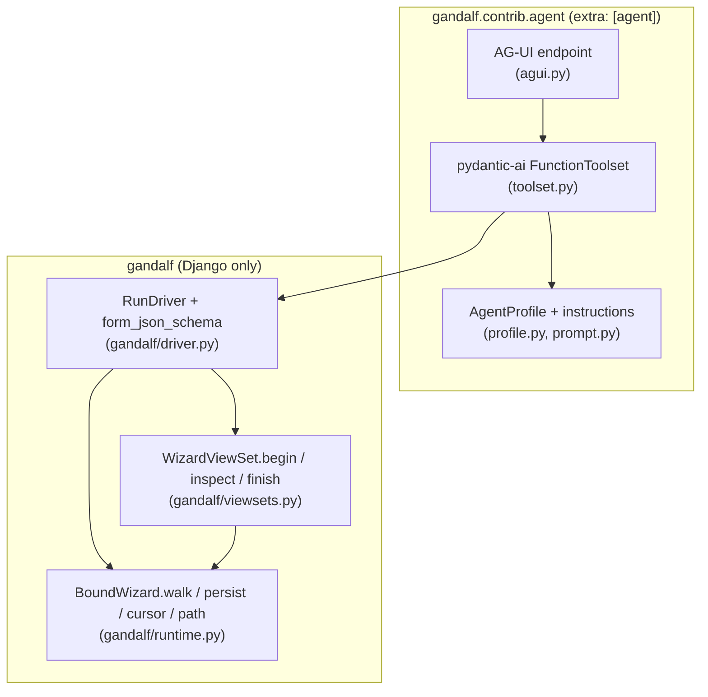

# Agent access

How an AI agent drives a gandalf wizard without clicking through the forms.

## Motivation

A wizard is a conversation the application scripts: ask this, then that,
branch on an answer, stop when everything holds. An AI agent holding the
user's answers should be able to have that conversation directly — submit a
step, learn what the next step wants, be told precisely what failed
validation — without rendering HTML, faking browser POSTs, or scraping error
lists out of markup.

The runtime already speaks this language. `BoundWizard.walk()` replays
stored answers, places a submission at a claimed step, and stops where the
run stops; `RuntimeStep.form` exposes a step's `errors` and `cleaned_data`
as data. What agents need is a thin layer that packages those mechanics
behind a small, serializable vocabulary: *describe the current step, submit
answers, read what's been answered, finish*.

## Layering

Two layers, the upper one deliberately thin:



- **`gandalf/driver.py`** — the headless driver, and the substance of this
  work. Django-only, strictly typed, part of the library. `RunDriver`
  binds a viewset's wizard to a `WizardContext` — the run's environment,
  which needs no browser and fabricates none — and exposes
  `describe()` (current step name, a JSON Schema for its form, answers so
  far, the last submission's errors), `submit()`, `answers()`, and
  `finish()`. `form_json_schema()` renders a Django form as a JSON Schema
  object so any schema-speaking client can learn what a step wants.
- **`gandalf/contrib/agent/`** — a pydantic-ai `FunctionToolset` wrapping
  `RunDriver`, the instructions that go with it, and an AG-UI endpoint
  that serves it from Django. It ships with the library behind an extra
  (`pip install django-gandalf[agent]`) and **names no model provider** —
  that is the caller's to choose and install. The core keeps its single
  dependency on Django, and a test walks the package to prove nothing
  outside `contrib/` imports pydantic-ai.

  It started as a spike under `examples/agents/`, which is where it
  belonged while the question "is this something people install?" was
  still open. It is, so it moved; the spike is gone rather than kept as a
  second implementation to drift against the first.

## Using it

The driver needs no HTTP machinery and no changes to the wizard:

```python
from gandalf.driver import RunDriver

# may_finish because this caller intends to conclude the run; without it
# finish() raises ConfirmationRequired.
driver = RunDriver.begin(SignupWizardViewSet, may_finish=True)

driver.describe().schema   # JSON Schema for the current step's form
driver.submit({"name": "Ada"})
result = driver.submit({"email": "ada@example.com"})
if result.status == "complete":
    response = driver.finish()   # fires done() exactly once
```

`submit()` returns `"advanced"`, `"invalid"` (with `errors` as
`form.errors.get_json_data()` output), `"complete"`, or `"escaped"` (with
the escape's name); `submit(data, step="account_type")` edits an earlier
answer and lets the walk re-route. `answers()` hands back cleaned values —
a `DateField` gives a `datetime.date` — and `submit()` takes them as they
are, so an edit is *read it, change one field, send it back* with nothing
to convert in between. Anything that has to serialise them asks instead:
`answers(json_safe=True)`, or `describe(json_safe=True)` to convert a whole
description without reading the answers twice. Runs are addressed by
`run_id`:
`RunDriver.resume(ViewSet, run_id, actor=...)` continues one, scoping it
to whoever it is for; pass `session=` instead to share a session-backed
storage with a browser, or a whole `context=` when you have one. No
request is involved, and none is fabricated — so a session given this way
is saved as the walk changes it, rather than by the middleware that is not
coming (*Sessions and the streamed response*).

The toolset is runnable end to end:

- `just test-agents` — deterministic tests, no API key needed (a scripted
  `FunctionModel` stands in for the LLM).
- `just copilotkit-server` + `just copilotkit-ui` — the hybrid prototype:
  a CopilotKit chat beside a live wizard panel, the agent's AG-UI
  endpoint hosted by Django itself, and a handover into the ordinary form
  for review and confirmation (`examples/copilotkit/README.md`).

## The tool surface

The toolset exposes a small, *static* vocabulary — `start_run`,
`resume_run`, `get_run`, `get_outline`, `check_answers`, `prefill`,
`submit_step`, `edit_step`, `handoff` — and puts the dynamism in the
payloads: every one of them returns the current step's JSON Schema, the
answers so far, and any validation errors. Branching and expansion need no
tool-level support at all; the walk decides where the run is and the tools
report it.

One tool is conditional: `attach_document` exists only for a wizard that
has somewhere to put a file. That is derived rather than declared —
`accepts_documents()` asks the outline whether any step describes a field
as `{"type": "string", "format": "binary"}`, which is how a JSON Schema
says "this is a file" — because a flag beside the wizard could only ever
agree with the tree or be quietly wrong. The tool takes an attachment the
person shared in the conversation and places the file itself, rather than
letting the model describe it in words. Underneath, the driver's own
vocabulary is `submit(files=...)` to place an upload and `open_file()` to
read one back, both over the `FileRef` a placement stores.

There is deliberately no tool that concludes a run — see *the agent never
confirms* in the demo's README.

The alternative — generating one typed tool per step from the wizard tree —
gives the model precise argument schemas but means the tool list churns as
branches select and expansions grow. Schema-as-data was chosen because it
is simpler, survives any tree shape, and translates unchanged to other
tool-speaking protocols if one is ever needed.

## Front-loading the interview

The reason an agent is worth pointing at a wizard at all: long wizards are
tedious, and most of their answers are already known — held in a profile,
inferable from the conversation, or copied from a previous run. The agent
should collect what it can *before* stepping, and ask the user only for
the residue. Two driver primitives make that a loop instead of a wish:

- **`outline()`** — the wizard's declared shape as data, before any answers
  exist. This one is not the driver's: `ConfiguredWizard.outline()` is core
  API, because a journey's shape is a property of the declaration rather
  than of a run — the driver only adds a JSON Schema per step, and
  `RunDriver.outline_for(ViewSet)` answers without starting anything. It
  gives: every step with its JSON Schema, every fork with *all* of its
  possible routes, and `expand` markers where the tree grows from an
  answer. A step whose hand-written view composes its form from missing
  answers reports `schema: None` until the walk reaches it.

  How much a fork explains itself depends on how it was declared, and
  there are three levels:

  | Declaration | What the outline says |
  |---|---|
  | `.branch(condition(pred, ...))` | each arm's predicate name and docstring — the author's own words |
  | `.switch(selector, {...})` | the *outcomes are named*: every case the selector could return, whatever the selector does inside |
  | `.switch(on_field(step, field), {...})` | the dependency as data: which step, which field, and which value selects which route |

  The last one is the only fully derivable case, and deliberately so — a
  selector is arbitrary code, so the library can carry an explanation but
  cannot compute one. `on_field` is worth reaching for whenever the fork
  really is just "what did they answer".
- **`prefill(answers)`** — place a whole bag of answers, keyed by step
  name, in one call. Placement follows the wizard's own routing to a
  fixpoint: an answer that selects a branch arm or grows an expansion
  reveals more steps, which consume more of the bag. The result is the
  residue report — what was placed, what was rejected and why, what was
  never asked for (a dormant arm, a step past a gap), and where the run
  now stands.

- **`check(answers)`** — the same bag, judged without placing any of it.
  Each candidate is bound to its own step's form and validated alone, so
  problems behind an unanswered step are visible *before* anything is
  written: `invalid` (with field errors), `missing` (steps the run will
  certainly reach with nothing to answer them), `unchecked` (couldn't be
  judged, and why), `unknown` (names no declared step yet), and `ok`.
  This is what lets an agent ask a person for everything in one message
  instead of discovering the problems one placement at a time.

  Three honesty constraints are built into the result. `ok` is not a
  promise — a standalone form knows nothing about the walk, and the real
  placement re-proves it. Steps behind a branch are left out of `missing`,
  because demanding every arm would ask for things the person will never
  be shown. And a `clean()` that escapes is *reported*, never acted on: a
  check is a question, not a submission.

The agent's flow becomes: outline → map known context onto schemas →
check → ask once for the whole residue → prefill → finish. Correctness
is untouched throughout: every prefilled answer replays through the walk
and is re-proved like any other submission, so a wrong guess surfaces as
an ordinary validation error rather than a corrupted run.

## The handover

Front-loading raises the obvious question: if an agent fills the form,
who is accountable for what it says? The answer gandalf already had is a
**review step** (`SummaryMixin`), and it turns out to be the whole
design. The agent fills everything up to the confirmation and stops; the
person lands on check-your-answers, sees every answer filled in their
name with a change link beside it, corrects what is wrong, and confirms.
`done()` fires once, on their submission.

What makes this more than a nice idea is that an agent-driven run **is** a
normal web run — the same `run_id`, the same stored state, the same walk.
Two things follow:

- With a durable `WizardStorage` the run is a row rather than a browser
  session, so the run the agent filled is the run the browser opens, and
  the owner scoping (`retrieve_run` raising `RunNotFound` for someone
  else's run) is the authorisation.
- With the shipped `SessionStorage` the run is in the session, and the
  AG-UI endpoint hands the agent the session the chat request arrived on
  — the same trust as running it as `request.user`. See *Sessions and the
  streamed response* below for the one setting that has to hold.
- The handover is just a URL: `bound_wizard.entry_url("confirm")` is the
  wizard's own step URL. Nothing is exported, copied, or re-validated
  specially — the person's first page load walks the same answers the
  same way.

An edit from the person behaves like any other edit: the walk re-routes
from the changed step, keeps every later answer that still holds, and
brings them back to the summary. `examples/copilotkit/` is this
end-to-end (chat → filled run → review → edit → quote), and
`tests/functional/test_hybrid_handoff.py` proves it with no model and no
browser.

## Sessions and the streamed response

An agent driving the shipped `SessionStorage` works on the browser's own
session, which is what makes a run it starts a run the person can open.
That needs a **server-side session backend** — `SESSION_ENGINE` set to
`db`, `cache`, `cached_db` or `file`. With `signed_cookies` the agent can
read the session and cannot write to it.

The reason is the streaming response rather than anything about agents.
`SessionMiddleware` saves the session as the response goes past, and for
a `StreamingHttpResponse` that moment is when the view *returns* — before
the first event, let alone the first tool call. So a run created while
the stream is running has missed the only save the request had, whatever
the backend. `WizardContext.persist()` is the answer: a context holding a
session with no request behind it writes each change back as it is made,
which a server-side store can do and a cookie cannot, its store being a
response header that has already gone.

That covers the driven path generally, not just this endpoint. A
management command or a test given somebody's session by
`RunDriver.begin(ViewSet, session=...)` has no response either, and now
saves as it goes for the same reason. On the HTTP path nothing changes —
the request is there, the middleware is coming, and `persist()` returns
without doing anything.

One wrinkle is handled in the endpoint rather than the context: a visitor
whose very first act is to open the chat has no session key yet, and a key
reaches the browser on a `Set-Cookie` header that goes out with those same
early headers. The endpoint creates the key before it starts streaming, so
what the tools write is written somewhere the next request can ask for.

Storage that scopes runs by `actor` — `ModelStorage` in the demo — sidesteps
all of this, which is the other reason to reach for it.

## Validation errors

The contract is `form.errors.get_json_data()`: field name → list of
`{"message", "code"}` — no HTML anywhere. The toolset surfaces it as
`ModelRetry` with the errors serialized into the message: the framework
turns that into a retry prompt and spends the tool's retry budget, and the
model corrects itself with no bespoke error plumbing. The walk keeps the
rejected submission, exactly as the HTTP layer does, so `get_current_step`
re-reports the errors until a valid answer replaces them.

## Why not MCP (yet)

An MCP server over the driver was built as part of the spike and worked —
pydantic-ai's `MCPToolset` drove it fully in-process — and was then removed
on purpose. MCP's reason to exist is crossing a boundary between software
that does not share a process or an author. An agent written in pydantic-ai
next to the Django project has no such boundary, so the protocol added a
second runtime (async FastMCP against sync Django), a second deployment
question, and a dependency, all to emulate what a plain toolset already
does.

The conclusion stands recorded here rather than in code: **MCP earns its
place the day an agent gandalf's user did not write needs to drive a
wizard** — Claude Code filling forms during development, a QA agent
exercising flows, a non-Python agent completing onboarding. When that day
comes, the adapter is a thin skin over the same driver, and two shapes are
worth prototyping first:

- a **stateless MCP endpoint as a plain Django view** (streamable HTTP
  allows single JSON responses), which keeps auth, sessions and storage
  inside Django's request cycle with zero new dependencies; or
- FastMCP's `http_app()` mounted beside Django under one ASGI process, if
  full protocol coverage (sessions, streaming) is needed.

A sidecar FastMCP process that imports Django remains the right shape only
for a locally-launched stdio server pointed at a dev database.

## pydantic-graph: overlap and non-overlap

pydantic-graph (the FSM library under pydantic-ai's agent loop) models
typed nodes whose outgoing edges come from return types, with `Decision`
for branching — structurally close to gandalf's tree:

| gandalf | pydantic-graph |
|---|---|
| `tree.Step` | a node / `@g.step` function |
| `tree.Branch` (predicates re-evaluated per walk) | `Decision` edges |
| `.expand()` (subtree grown from a prior answer) | no analogue — graphs are fixed at build time |
| cursor walk re-proving every stored answer | no analogue — execution runs forward once |
| `WizardStorage` (pause anywhere, resume any request) | **removed** — pydantic-graph 2.x dropped state persistence |

The last two rows are the decision. A wizard's defining property is that it
is *interrupted by design* — every step boundary is a pause that must
survive process death, and re-entry re-validates rather than trusts.
pydantic-graph 2.x removed its persistence layer (snapshotting was
incompatible with its parallel execution model), so it can model the
topology but not the pausing. Conclusion: conceptual kinship, no
dependency — gandalf's storage stays the source of truth, and `run_id` is
the resume token. Where pause/resume of the *agent* (not the wizard) is
needed, pydantic-ai's own deferred-tools / `message_history` flow covers
it; the wizard run is unaffected either way.

## Packaging: what ships, and why

The decision, now that the spike has settled: **the driver ships in
`django-gandalf` itself; the pydantic-ai layer ships too, behind an
extra.**

**`gandalf/driver.py` is in the package.** It imports nothing beyond Django
and gandalf, so it adds no dependency, no setting, no migration and no
import-time cost to anyone who never touches it — a module nobody imports
is never executed. That makes it exactly as optional as `tasklists.py`
or `summary.py`, both of which most users never
reach for. It is also not really an AI feature: with the LLM removed the
surface reads *begin, describe, submit, answers, outline, prefill, check,
finish*, which is a data import, a management command or a test as much as
it is an agent.

**The pydantic-ai layer is in `gandalf/contrib/agent/`, behind the
`[agent]` extra.** It began as a spike under `examples/`, on the argument
that a recipe everyone forks belongs where recipes go. The argument did
not survive contact: the layer people wanted was not a recipe to copy but
a toolset to install, and a copy under `examples/` is a second
implementation that drifts against the first. So it moved, and the spike
was deleted rather than kept.

What moving cost was paid rather than avoided. It does drag a third-party
package into the gates — so `just typecheck` runs with `--extra agent`
(mypy cannot check what it cannot resolve) and its toolset, prompt and
profile are measured to 100% by `just coverage-unit`, with the AG-UI
endpoint covered by the functional suite instead, since an endpoint that
streams over ASGI can only honestly be covered by a real request. It does
track a dependency that broke most of its own API within a year — this
work hit that churn directly, which is an argument for a version bound
(`pydantic-ai-slim[ag-ui]~=2.30`) rather than for exile. And it stays the
layer a user may well fork for their own tool names, prompts, auth and
error handling; what makes that cheap is that it is thin and *names no
model provider*, not that it lives somewhere else.

**The standing rule holds: pydantic-ai never becomes a runtime dependency
of `django-gandalf`.** An optional extra is not a runtime dependency — the
core installs Django and nothing else, and a test walks the package to
prove nothing outside `contrib/` imports pydantic-ai.

### Why not a separate package

A satellite (`django-gandalf-agents`) was considered seriously, and the
work was kept viable for it: everything the driver uses is public API,
and `WizardViewSet.finish()` was promoted to public precisely so no
external package would have to copy the `done() → cleanup_files() →
complete()` ordering.

It was rejected on evidence rather than principle. `outline()` reads the
declaration tree directly, so it tracks the tree's *shape* by design — and
that coupling is not incidental, it is the feature. Twice during this work
a single coherent change spanned both sides: adding `.switch()` required
the outline to learn about switches in the same commit, and surfacing
branch-arm names touched `tree.py` and the driver together. In one repo
those are one commit and one test run. Across two they are a release
dance — land in core, release, bump a pin, land in the satellite, release
again — leaving the satellite permanently one step behind its own
dependency. The sync cost is paid by the maintainer; the benefit to a
non-user is zero, since the module costs them nothing either way.

## Future directions

- **Auth.** The hybrid demo signs everyone in as one demo user. A real
  deployment scopes runs to the authenticated person and lets the agent
  act only within that scope — the storage protocol is already the seam
  for it.
- **An MCP endpoint** — when an external client appears; see
  [Why not MCP (yet)](#why-not-mcp-yet).
- **Dynamic per-step tools.** A pydantic-ai `AbstractToolset.get_tools()`
  is consulted every run step, so exactly one `submit_<step>` tool with the
  step's real schema could exist at a time. Stronger typing for the model,
  at the cost of tool churn.
- **Human handoff.** pydantic-ai's deferred tools (`ApprovalRequired`,
  `DeferredToolRequests` + `message_history` resume) let an agent pause
  mid-wizard for a person to answer a step, with the run itself already
  safe in gandalf storage.
