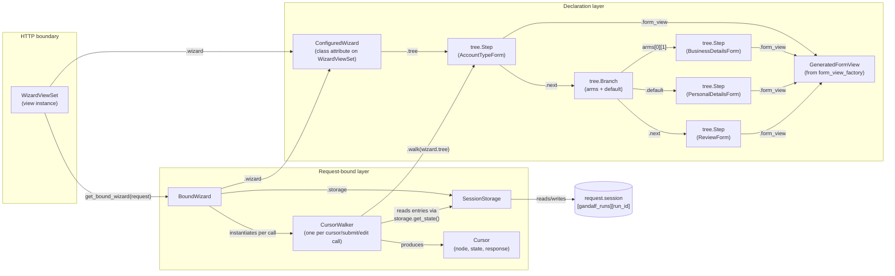
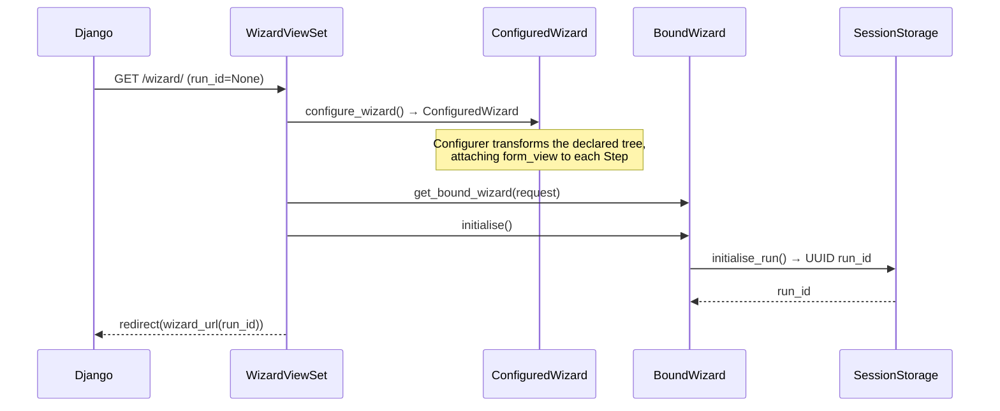
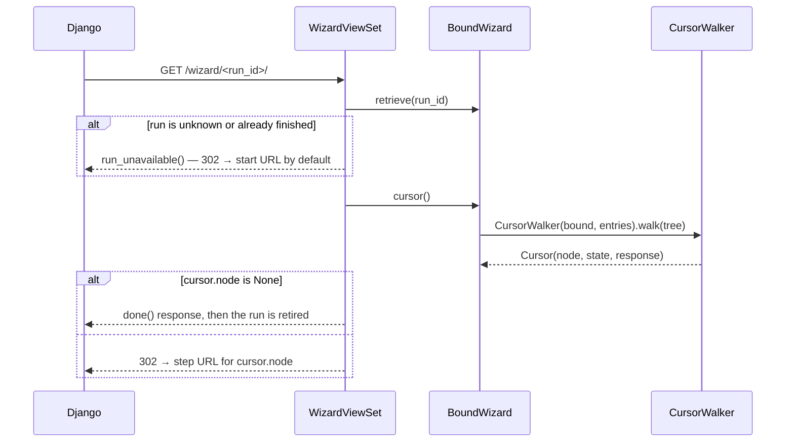
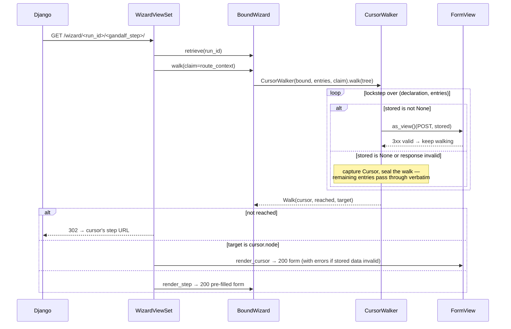

# Architecture

## Module map

| Module | Role |
|---|---|
| `gandalf/tree.py` | Immutable wizard tree — `Step` and `Branch` frozen dataclasses linked via `.next`; `build()` threads `next` from a flat declaration list. Also defines the four traversal kinds (`Visitor`, `Interpreter`, `Transformer`, `Reducer`) and the `Configurer` transformer that attaches `form_view` classes to each `Step` |
| `gandalf/wizard.py` | Declarative builder — `Wizard` (fluent `.step()` / `.branch()` API) and `ConfiguredWizard` (post-`.configure()`, holds the configured tree and pluggable class slots: `file_storage_class`, `cursor_walker_class`, `step_dispatcher_class`, `state_serializer_class`, `step_router_class`, `form_view_factory`). Storage is deliberately not among them — it lives on `WizardViewSet`, since it must exist before `get_wizard()` can be called |
| `gandalf/form_views.py` | `form_view_factory()` — generates a `FormView` subclass from a plain `Form` class |
| `gandalf/escapes.py` | The escape exceptions a step raises to leave the wizard — `Escape` (base) and `Park` / `Advance` / `Obliterate`, which differ in what they leave of the run |
| `gandalf/storage.py` | `SessionStorage` — JSON persistence to `request.session`. Knows nothing about tree shape; reads and writes a `state` list per `run_id`, swaps it for a completion marker when a run finishes, and raises `RunNotFound` for a run the session does not hold |
| `gandalf/runtime.py` | Request-bound runtime. `BoundWizard.walk()` is the single operation: replay stored answers, put a submission at the step a claim names, stop where it stops. `cursor()` and `render_step()` are callers of it. `CursorWalker` (an `Interpreter`) locates the cursor and builds the one runtime tree everything uses — validated up to the cursor, carried verbatim past it; `runtime_tree` and `path` (which carries `find_step` / `filter_steps`) all derive from it. `Cursor` is the decision object — `(node, state, response, escapes)`. `StateSerializer` (a `Reducer`) flattens a runtime tree back into the stored list shape. `RuntimeStep` / `RuntimeBranch` are the per-request mirrors of declared nodes; `PreservedBranch` is the opaque passthrough for branch entries positioned after the cursor |
| `gandalf/viewsets.py` | `WizardViewSet` — Django `View` subclass; HTTP boundary for GET and POST. Every request routes through step URLs (`_routed_get` / `_routed_post`); `urls()` publishes the patterns from `url_name`, and `get_wizard_url` / `get_step_url` reverse them |

---

## The cursor: the central decision point

Every request that does real work reduces to "find the cursor, then act on its fields":

```python
@dataclass(frozen=True)
class Cursor:
    node: tree.Step | None                            # which step the user is at
    state: RuntimeStep | RuntimeBranch | None         # the full runtime tree for this walk
    response: Any = None                              # rendered invalid form, if stored data no longer validates
    escapes: tuple = ()                               # (declaration, Escape) pairs raised on this walk
```

- `node is None` → wizard is complete; viewset calls `done()` and retires the run, so it fires exactly once.
- `response is not None` → re-validation of stored data failed; return that rendered response directly.
- otherwise → dispatch a GET to `node.form_view` to render the step.
- `state` is what `submit()` re-serializes back to storage to advance the wizard. It spans the whole declaration tree: entries before the cursor are validated, the cursor's slot holds the pending submission (or the kept invalid/missing data), and entries after the cursor ride along verbatim so answers past the cursor are never lost.
- `escapes` records steps that raised an `Escape` while validating. An escape satisfies its step, so the walk continues; the viewset consults `escape_for(declaration)` for the step just submitted and redirects out of the wizard if it finds one.

`CursorWalker` is the only thing that produces a `Cursor`. `BoundWizard.walk()` is the only thing that drives it, and everything else — `cursor()`, `render_step()`, the viewset's GET and POST — is a caller of that one walk.

---

## Object graph for one request



`form_view_factory()` produces one `GeneratedFormView` class per `Step`, but the diagram collapses them to a single node; each `Step.form_view` points to its own generated class.

The `runtime_tree` property (and `path`, with its `find_step` / `filter_steps`, on top of it) is the same walk: it reuses the render context's cursor when the viewset recorded one, and performs one `CursorWalker` pass otherwise. There is no separate introspection builder.

---

## Request lifecycle

### GET — first visit (no `run_id`)



### GET — bare run URL (with `run_id`, no step segment)



### GET — step URL



### POST — step URL

```mermaid
sequenceDiagram
    participant Django
    participant WVS as WizardViewSet
    participant BW as BoundWizard
    participant SS as SessionStorage
    participant CWK as CursorWalker
    participant SER as StateSerializer

    Django->>WVS: POST /wizard/<run_id>/<gandalf_step>/
    WVS->>BW: retrieve(run_id)
    WVS->>BW: walk(claim=route_context, submission=request.POST.dict())
    Note over CWK: replay stored answers; at the claimed step put the<br/>submission there instead; carry on; stop where it stops
    CWK-->>BW: Walk(cursor, reached, target)
    alt not reached
        WVS-->>Django: 302 → cursor's step URL (nothing stored)
    end
    alt the submitted step escaped
        Note over WVS: settle the run per the escape — nothing is written yet,<br/>so Park simply declines to persist, Obliterate deletes<br/>the run, and Advance persists
        WVS-->>Django: 302 → the escape's target
    end
    WVS->>BW: persist(walk)
    BW->>SER: reduce(walk.cursor.state) → new entries
    BW->>SS: set_state(run_id, new entries)
    Note over WVS: re-resolve the wizard; only if it comes back a<br/>different object (a dynamic get_wizard()) is a second<br/>walk needed to judge completion
    WVS->>BW: cursor()
    alt next cursor.node is None
        WVS-->>Django: done() response, then the run is retired
    else
        WVS-->>Django: 302 → next cursor's step URL (PRG)
    end
```

A POST therefore walks the tree **once**, and the follow-up GET walks once more to render. There is no separate submit and edit path: placing an answer at a step is one operation, and whether that step already had an answer changes nothing about the mechanics.

The invariant that follows is worth holding on to while debugging:

> A form's `clean()` runs **once per completed step per HTTP request**.

So with `k` answers already stored a POST costs `k+1` validations — the `k` replays plus one live dispatch of the answer just submitted — and the follow-up GET costs `k+1` again, because it is a separate request that has to re-derive position from stored state. Completing an `N`-step run therefore costs `N²` validations in total. `tests/functional/test_walk_cost.py` asserts these counts exactly, and `benchmarks/` (`just bench`) measures them across shapes and sizes.

A **dynamic** `get_wizard()` is the one case that needs a second walk. It derives the tree from stored state, so the answer just written can imply steps that did not exist when the request began; judging completion against the pre-write tree would fire `done()` mid-run. `_refreshed_cursor` re-resolves the wizard and only walks again when that hands back a different object, so a static wizard never pays for it.

Note the ordering: nothing is persisted until the walk has finished, so an `Escape` is settled before any write. `Park` simply declines to persist rather than having to undo a write. `CursorWalker` catches escapes uniformly and records them on the `Cursor`; a caught escape marks its step satisfied, so replays of a stored escaping answer keep walking. Only the viewset acts on one, and only for the step just submitted — but it acts wherever that step sits, since there is no longer an edit path for a disposition to be defined against.

---

## State storage shape

State is stored in `request.session["gandalf_runs"][run_id]["state"]` as a list that **mirrors the shape of the wizard tree**. Each entry is one of:

```python
{"step": {…form_data…}}                        # a tree.Step node — holds submitted form data
{"step": None}                                 # a hole — the slot exists but has no valid answer yet
{"branch": {"<arm_id>": [{…sub-entries…}]}}    # a tree.Branch node — sub-entries keyed per arm
```

Branch entries are keyed by arm id — the arm's declaration-order index as a string, or `"default"`. The active arm's answers live under its key; other keys are **dormant memory**: they are carried verbatim (never validated, never descended into) so that changing a branch answer parks the old arm's data instead of discarding it, and flipping back restores it. A missing key means that arm has never been answered. Bare-list branch entries (the pre-per-arm shape) are still read, treated as belonging to whichever arm is derived on that walk — a best-effort adoption: a request-dependent predicate (user role, feature flag) that derives a different arm than the legacy entries were recorded under will misattribute them, the same exposure the pre-per-arm code had.

Branch **decisions** are still never persisted. On every walk the active arm is re-derived by evaluating each branch predicate against the runtime-tree prefix built so far; the arm id only keys which stored memory is live. `SessionStorage` is deliberately tree-shape-agnostic — it just reads and writes a list; the lockstep walk in `CursorWalker` is what makes the list mean something.

Steps have no stable identifier. Alignment between declaration and stored entries is purely positional, which is why the stored shape must mirror the AST: each walker pops one entry per node as it descends. (Arm ids are positional too — a dynamic `get_wizard()` that reorders branch arms between requests can misattribute dormant memory, the same way reordering steps misaligns entries.)

The list is a **full-tree mirror with holes**, not a prefix. `CursorWalker` validates entries until it finds the cursor (the first missing or no-longer-valid answer), then *seals*: remaining step entries are carried verbatim and remaining branch entries become opaque `PreservedBranch` passthroughs (no arm is derived there — predicates might depend on the missing answer). Serializing the walk therefore keeps every answer positioned after the cursor. An entry that no longer validates keeps its data and replays as the errored form for correction. `StateSerializer` trims trailing holes and omits empty arms at every level, so simple linear progress still stores the same minimal prefix it always did.

### Example — branching wizard state after three steps

```python
# wizard declaration
from django import forms
from gandalf.wizard import Wizard, condition

wizard = (
    Wizard()
    .step(AccountTypeForm)
    .branch(
        condition(is_business, Wizard().step(BusinessDetailsForm)),
        default=Wizard().step(PersonalDetailsForm),
    )
    .step(ReviewForm)
).configure(template_name="wizard/step.html")
```

After the user completes all three steps via the business arm:

```python
[
    {"step": {"account_type": "business"}},
    {"branch": {"0": [{"step": {"business_name": "Acme Ltd"}}]}},
    {"step": {"confirmed": True}},
]
```

If the user then edits the first answer to `personal`, the business arm goes dormant and the confirmed review answer is preserved; only the personal arm's step is asked before the wizard is complete again:

```python
[
    {"step": {"account_type": "personal"}},
    {"branch": {"0": [{"step": {"business_name": "Acme Ltd"}}]}},
    {"step": {"confirmed": True}},
]
```

---

## Branch arm selection

Branch predicates receive a wizard-shaped request whose `.wizard` attribute is the `BoundWizard` itself. From there they can inspect the validated prefix built so far via `request.wizard.path.find_step()` / `path.filter_steps()` — `path` is predicate-aware, so mid-walk it is the answered steps up to the branch:

```python
from gandalf.wizard import Wizard, condition

def is_business(request):
    step = request.wizard.path.find_step(name="account")
    return step.data["account_type"] == "business"

wizard = (
    Wizard()
    .step(AccountTypeForm, context={"name": "account"})
    .branch(
        condition(is_business, Wizard().step(BusinessDetailsForm)),
        default=Wizard().step(PersonalDetailsForm),
    )
    .step(ReviewForm)
)
```

`BoundWizard._select_branch_arm()` (called from inside `CursorWalker` when it hits a `tree.Branch`) temporarily sets `self._predicate_runtime_tree` to the partial runtime head built up to the branch, evaluates each arm predicate in declaration order, and returns `(arm_id, subtree)` for the first matching arm — or `("default", Branch.default)`. The partial-tree handoff is what lets predicates see prior answers without seeing future ones; the arm id keys which per-arm memory in the branch's stored entry is live for this walk.

This yields a guarantee: because the sealed walk is the only thing that ever selects arms, **a branch predicate only ever runs behind a fully-validated prefix** — every step before the branch is answered and currently valid when the predicate executes. Predicates can dereference prior answers (`path.find_step(...).data["key"]`) unconditionally. The corollary is that steps off the resolved route are invisible to `path.find_step`: it returns `None` for the current unanswered step, any step not yet reached, and steps inside a branch whose arm cannot be derived yet.

---

## Step URL routing

Steps are addressed by URL — there is no unrouted mode. `StepNameRouter` (`gandalf/wizard.py`, the `step_router_class` slot) maps the `gandalf_step` URL kwarg to a step-context lookup and reverses a step declaration back into a URL segment (`name` context by default; subclass to route on another key). The viewset validates at request time that the configured router can reverse every declared step, raising `ImproperlyConfigured` for unnamed steps.

On a step-URL request the viewset hands the claim to the walk. Reaching the claimed step *is* the authorisation: the walk only arrives there by validating everything before it, so a URL naming a step this run cannot reach — unknown, not yet reached, or parked in a dormant arm — never becomes a placement, and redirects to the cursor's URL instead. A reached step renders (pre-filled if it already has an answer) or takes the submission. The bare run URL redirects to the cursor's step URL (or fires `done()` on completion), and a bare-URL POST redirects without storing. Successful POSTs redirect (POST→redirect→GET); the URL is never trusted to *set* position, only checked against the derived cursor.

All of that presumes a live run. A run that is finished — or one the session never held — is intercepted before the wizard is even resolved (a completed run has no state left, and a dynamic `get_wizard()` is entitled to read state), and answered by `WizardViewSet.run_unavailable(bound_wizard, reason)`. That single interception is what makes `done()` exactly-once: no URL under a retired run can reach the cursor machinery again.
