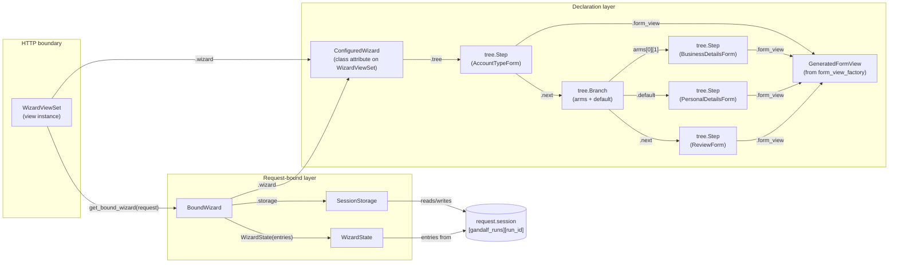
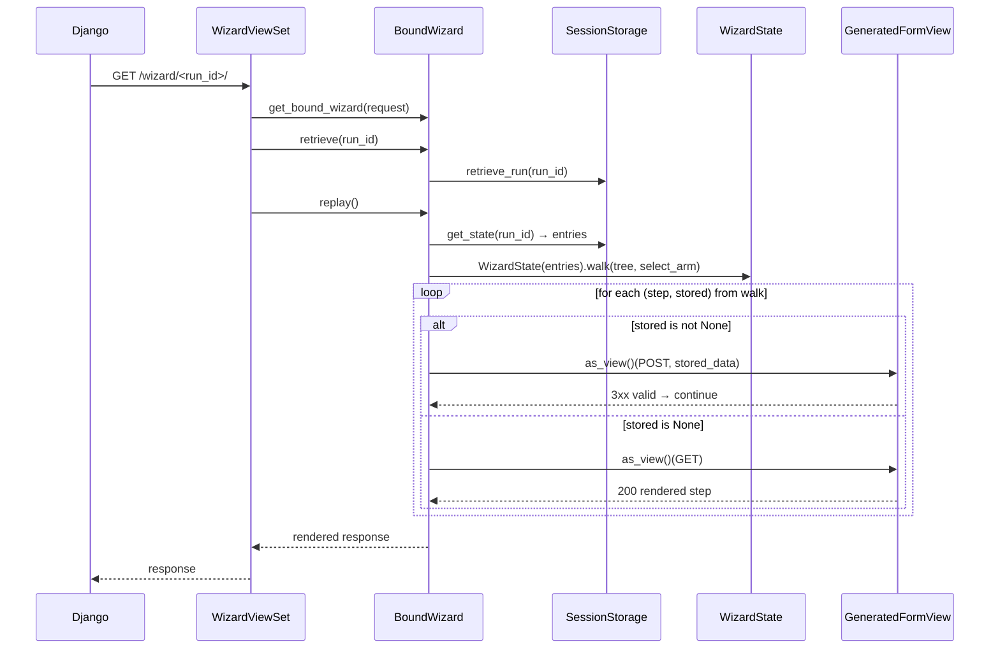
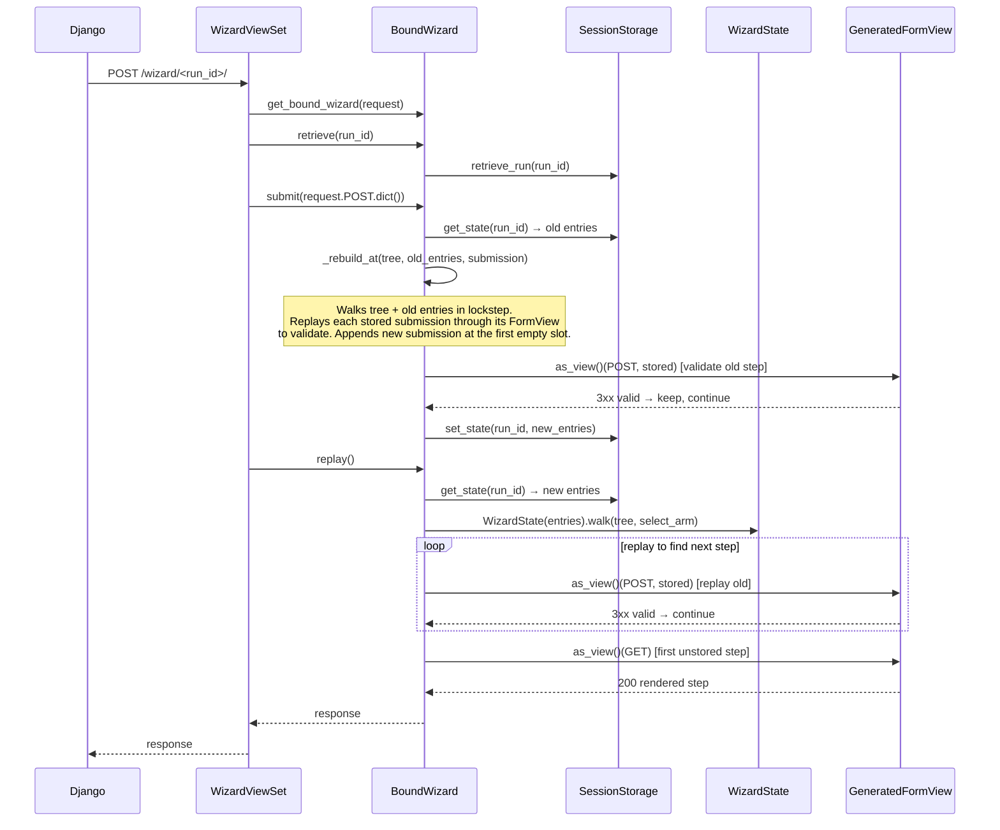

# Architecture

## Module map

| Module | Role |
|---|---|
| `gandalf/tree.py` | Immutable wizard tree — `Step` and `Branch` frozen dataclasses linked via `next` pointers; `build()` threads `next` from a flat declaration list |
| `gandalf/wizards.py` | Declarative builder — `Wizard` (fluent `.step()` / `.branch()` API) and `ConfiguredWizard` (post-`.configure()`, holds `storage_class` and fully-configured tree) |
| `gandalf/form_views.py` | `form_view_factory()` — generates a `FormView` subclass from a plain `Form` class |
| `gandalf/storage.py` | `SessionStorage` (JSON persistence to `request.session`) and `WizardState` (lockstep walker that zips the wizard tree with the stored state list) |
| `gandalf/runtime.py` | `BoundWizard` — request-bound runtime; drives `replay()` and `submit()`; `_BranchView` exposes `get_submissions()` to branch predicates |
| `gandalf/viewsets.py` | `WizardViewSet` — Django `View` subclass; HTTP boundary for GET and POST |

---

## Object graph for one request

The diagram below shows the objects created and how they reference each other during a single request.



`form_view_factory()` produces one `GeneratedFormView` class per `Step`, but the diagram collapses them to a single node for clarity; each `Step.form_view` points to its own generated class.

---

## Request lifecycle

### GET — first visit (no `run_id`)


### GET — returning visit (with `run_id`)



### POST — step submission



---

## State storage shape

State is stored in `request.session["gandalf_runs"][run_id]["state"]` as a list that **mirrors the shape of the wizard tree**. Each entry is one of:

```python
{"step": {…form_data…}}         # a tree.Step node — holds submitted form data
{"branch": [{…sub-entries…}]}   # a tree.Branch node — sub-entries record the taken arm
```

Branch decisions are **never persisted**. On every replay `WizardState` re-derives which arm was taken by re-evaluating the branch predicate against the submissions accumulated so far.

### Example — branching wizard state after three steps

```python
# wizard declaration
from django import forms
from gandalf.wizards import Wizard, condition

wizard = (
    Wizard()
    .step(AccountTypeForm)
    .branch(
        condition(is_business, Wizard().step(BusinessDetailsForm)),
        default=Wizard().step(PersonalDetailsForm),
    )
    .step(ReviewForm)
).configure(template_name="wizard/step.html")
```

After the user completes all three steps via the business arm:

```python
[
    {"step": {"account_type": "business"}},
    {"branch": [{"step": {"business_name": "Acme Ltd"}}]},
    {"step": {"confirmed": True}},
]
```

---

## Branch arm selection

Branch predicates receive a thin request-like object whose `.wizard.get_submissions()` returns the list of form-data dicts submitted so far in the current run.

```python
from gandalf.wizards import Wizard, condition

def is_business(request):
    return request.wizard.get_submissions()[0]["account_type"] == "business"

wizard = (
    Wizard()
    .step(AccountTypeForm)
    .branch(
        condition(is_business, Wizard().step(BusinessDetailsForm)),
        default=Wizard().step(PersonalDetailsForm),
    )
    .step(ReviewForm)
)
```

`BoundWizard._select_branch_arm()` constructs the `_BranchView` wrapper and evaluates each arm predicate in declaration order, returning the first matching arm's subtree or `Branch.default`.
