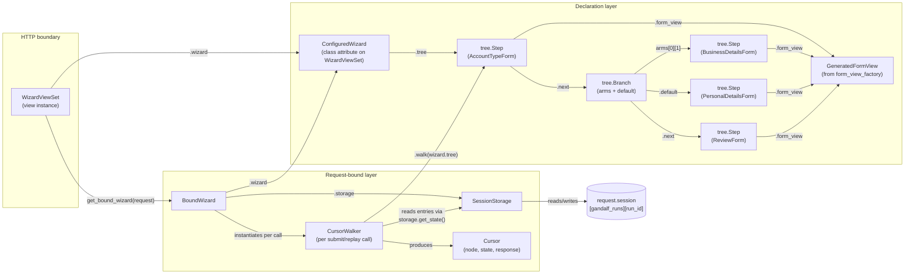
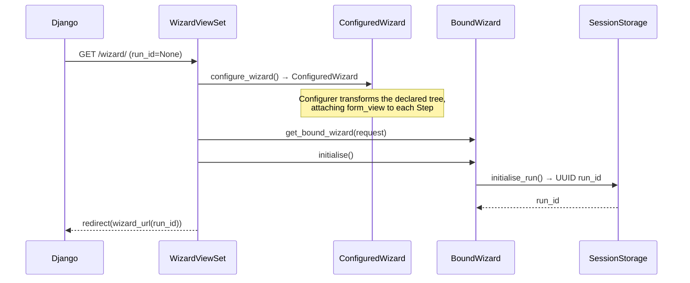
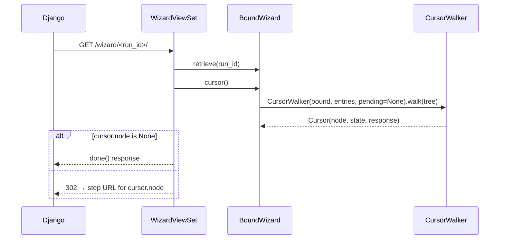
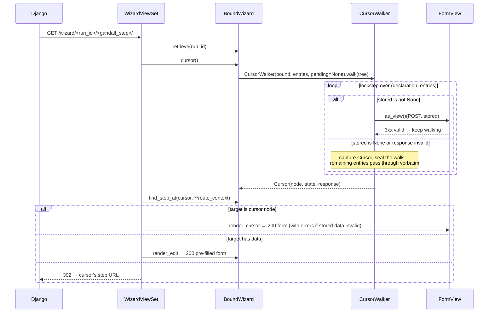

# Architecture

## Module map

| Module | Role |
|---|---|
| `gandalf/tree.py` | Immutable wizard tree — `Step` and `Branch` frozen dataclasses linked via `.next`; `build()` threads `next` from a flat declaration list. Also defines the four traversal kinds (`Visitor`, `Interpreter`, `Transformer`, `Reducer`) and the `Configurer` transformer that attaches `form_view` classes to each `Step` |
| `gandalf/wizard.py` | Declarative builder — `Wizard` (fluent `.step()` / `.branch()` API) and `ConfiguredWizard` (post-`.configure()`, holds the configured tree and pluggable class slots: `storage_class`, `runtime_tree_builder_class`, `cursor_walker_class`, `state_serializer_class`, `form_view_factory`) |
| `gandalf/form_views.py` | `form_view_factory()` — generates a `FormView` subclass from a plain `Form` class |
| `gandalf/storage.py` | `SessionStorage` — JSON persistence to `request.session`. Knows nothing about tree shape; reads and writes a `state` list per `run_id` |
| `gandalf/runtime.py` | Request-bound runtime. `BoundWizard` orchestrates `cursor()`, `submit()`, and the transactional `edit()`. `CursorWalker` (an `Interpreter`) locates the cursor and builds a full-length runtime tree in lockstep with stored entries — validated up to the cursor, carried verbatim past it. `RuntimeTreeBuilder` (an `Interpreter`) builds the full active-route runtime tree for introspection. `Cursor` is the decision object — `(node, state, response)`. `StateSerializer` (a `Reducer`) flattens a runtime tree back into the stored list shape. `RuntimeStep` / `RuntimeBranch` are the per-request mirrors of declared nodes; `PreservedBranch` is the opaque passthrough for branch entries positioned after the cursor |
| `gandalf/viewsets.py` | `WizardViewSet` — Django `View` subclass; HTTP boundary for GET and POST. Every request routes through step URLs (`_routed_get` / `_routed_post`); `urls()` publishes the patterns from `url_name`, and `get_wizard_url` / `get_step_url` reverse them |

---

## The cursor: the central decision point

Every request that does real work reduces to "find the cursor, then act on its three fields":

```python
@dataclass(frozen=True)
class Cursor:
    node: tree.Step | None                            # which step the user is at
    state: RuntimeStep | RuntimeBranch | None         # the full runtime tree for this walk
    response: Any = None                              # rendered invalid form, if stored data no longer validates
```

- `node is None` → wizard is complete; viewset calls `done()`.
- `response is not None` → re-validation of stored data failed; return that rendered response directly.
- otherwise → dispatch a GET to `node.form_view` to render the step.
- `state` is what `submit()` re-serializes back to storage to advance the wizard. It spans the whole declaration tree: entries before the cursor are validated, the cursor's slot holds the pending submission (or the kept invalid/missing data), and entries after the cursor ride along verbatim so answers past the cursor are never lost.

`CursorWalker` is the only thing that produces a `Cursor`. Every entry point below it (`BoundWizard.submit`, `BoundWizard.replay`) consumes one and switches on those fields.

---

## Object graph for one request



`form_view_factory()` produces one `GeneratedFormView` class per `Step`, but the diagram collapses them to a single node; each `Step.form_view` points to its own generated class.

`RuntimeTreeBuilder` is omitted from the diagram — it's a parallel `Interpreter` used by `BoundWizard.find_step()` / `filter_steps()` and by the `runtime_tree` property for introspection. It does not produce a cursor and is not on the submit/replay path.

---

## Request lifecycle

### GET — first visit (no `run_id`)



### GET — bare run URL (with `run_id`, no step segment)



### GET — step URL



### POST — step URL

```mermaid
sequenceDiagram
    participant Django
    participant WVS as WizardViewSet
    participant BW as BoundWizard
    participant SS as SessionStorage
    participant CWK as CursorWalker
    participant SER as StateSerializer

    Django->>WVS: POST /wizard/<run_id>/<gandalf_step>/
    WVS->>BW: retrieve(run_id)
    WVS->>BW: cursor(); find_step_at(cursor, **route_context)
    alt target is cursor.node
        WVS->>BW: submit(request.POST.dict())
        BW->>CWK: walk(tree) placing pending at the cursor slot
        BW->>SER: reduce(cursor.state) → new entries
        BW->>SS: set_state(run_id, new entries)
    else target has data
        WVS->>BW: edit(submission, **route_context)
        Note over BW: validates first; invalid → 200 error render,<br/>state untouched (transactional)
    else
        WVS-->>Django: 302 → cursor's step URL (nothing stored)
    end
    WVS->>BW: cursor()
    alt next cursor.node is None
        WVS-->>Django: done() response
    else
        WVS-->>Django: 302 → next cursor's step URL (PRG)
    end
```

A successful POST therefore walks the tree twice (once to place and persist, once to find the redirect target), and the follow-up GET walks again to render. All walks use the same `CursorWalker` class.

---

## State storage shape

State is stored in `request.session["gandalf_runs"][run_id]["state"]` as a list that **mirrors the shape of the wizard tree**. Each entry is one of:

```python
{"step": {…form_data…}}                        # a tree.Step node — holds submitted form data
{"step": None}                                 # a hole — the slot exists but has no valid answer yet
{"branch": {"<arm_id>": [{…sub-entries…}]}}    # a tree.Branch node — sub-entries keyed per arm
```

Branch entries are keyed by arm id — the arm's declaration-order index as a string, or `"default"`. The active arm's answers live under its key; other keys are **dormant memory**: they are carried verbatim (never validated, never descended into) so that changing a branch answer parks the old arm's data instead of discarding it, and flipping back restores it. A missing key means that arm has never been answered. Bare-list branch entries (the pre-per-arm shape) are still read, treated as belonging to whichever arm is derived on that walk — a best-effort adoption: a request-dependent predicate (user role, feature flag) that derives a different arm than the legacy entries were recorded under will misattribute them, the same exposure the pre-per-arm code had.

Branch **decisions** are still never persisted. On every walk the active arm is re-derived by evaluating each branch predicate against the runtime-tree prefix built so far; the arm id only keys which stored memory is live. `SessionStorage` is deliberately tree-shape-agnostic — it just reads and writes a list; the lockstep walk in `CursorWalker` / `RuntimeTreeBuilder` is what makes the list mean something.

Steps have no stable identifier. Alignment between declaration and stored entries is purely positional, which is why the stored shape must mirror the AST: each walker pops one entry per node as it descends. (Arm ids are positional too — a dynamic `get_wizard()` that reorders branch arms between requests can misattribute dormant memory, the same way reordering steps misaligns entries.)

The list is a **full-tree mirror with holes**, not a prefix. `CursorWalker` validates entries until it finds the cursor (the first missing or no-longer-valid answer), then *seals*: remaining step entries are carried verbatim and remaining branch entries become opaque `PreservedBranch` passthroughs (no arm is derived there — predicates might depend on the missing answer). Serializing the walk therefore keeps every answer positioned after the cursor. An entry that no longer validates keeps its data and replays as the errored form for correction. `StateSerializer` trims trailing holes and omits empty arms at every level, so simple linear progress still stores the same minimal prefix it always did.

### Example — branching wizard state after three steps

```python
# wizard declaration
from django import forms
from gandalf.wizard import Wizard, condition

wizard = (
    Wizard()
    .step(AccountTypeForm)
    .branch(
        condition(is_business, Wizard().step(BusinessDetailsForm)),
        default=Wizard().step(PersonalDetailsForm),
    )
    .step(ReviewForm)
).configure(template_name="wizard/step.html")
```

After the user completes all three steps via the business arm:

```python
[
    {"step": {"account_type": "business"}},
    {"branch": {"0": [{"step": {"business_name": "Acme Ltd"}}]}},
    {"step": {"confirmed": True}},
]
```

If the user then edits the first answer to `personal`, the business arm goes dormant and the confirmed review answer is preserved; only the personal arm's step is asked before the wizard is complete again:

```python
[
    {"step": {"account_type": "personal"}},
    {"branch": {"0": [{"step": {"business_name": "Acme Ltd"}}]}},
    {"step": {"confirmed": True}},
]
```

---

## Branch arm selection

Branch predicates receive a wizard-shaped request whose `.wizard` attribute is the `BoundWizard` itself. From there they can inspect the runtime tree built so far via `find_step()` / `filter_steps()`:

```python
from gandalf.wizard import Wizard, condition

def is_business(request):
    step = request.wizard.find_step(step_name="account")
    return step.data["account_type"] == "business"

wizard = (
    Wizard()
    .step(AccountTypeForm, context={"step_name": "account"})
    .branch(
        condition(is_business, Wizard().step(BusinessDetailsForm)),
        default=Wizard().step(PersonalDetailsForm),
    )
    .step(ReviewForm)
)
```

`BoundWizard._select_branch_arm()` (called from inside both `CursorWalker` and `RuntimeTreeBuilder` when they hit a `tree.Branch`) temporarily sets `self._predicate_runtime_tree` to the partial runtime head built up to the branch, evaluates each arm predicate in declaration order, and returns `(arm_id, subtree)` for the first matching arm — or `("default", Branch.default)`. The partial-tree handoff is what lets predicates see prior answers without seeing future ones; the arm id keys which per-arm memory in the branch's stored entry is live for this walk.

One robustness note: `CursorWalker` never evaluates predicates past the cursor (sealed branches are opaque), but `RuntimeTreeBuilder` — which backs `runtime_tree`, `path`, `find_step`, and edit-target resolution — builds the whole tree even when earlier answers are missing or dormant. A predicate that dereferences another step's data unconditionally (`find_step(...).data["key"]`) can therefore raise when that step is unanswered or parked in a dormant arm. Predicates used alongside mid-run introspection should tolerate missing data (e.g. guard on `step is None or step.data is None`).

---

## Step URL routing

Steps are addressed by URL — there is no unrouted mode. `StepNameRouter` (`gandalf/wizard.py`, the `step_router_class` slot) maps the `gandalf_step` URL kwarg to a step-context lookup and reverses a step declaration back into a URL segment (`step_name` context by default; subclass to route on another key). The viewset validates at request time that the configured router can reverse every declared step, raising `ImproperlyConfigured` for unnamed steps.

On a step-URL request the viewset derives the cursor, resolves the claimed step with `BoundWizard.find_step_at(cursor, **context)` — a `ContextFinder` pass over the **sealed walk's tree** rather than `RuntimeTreeBuilder`'s, so no branch predicate ever runs past the cursor and dormant arms are invisible — and then: the cursor's step renders/submits, a data-bearing step renders pre-filled/edits, anything else redirects to the cursor's URL. The bare run URL redirects to the cursor's step URL (or fires `done()` on completion), and a bare-URL POST redirects without storing. Successful POSTs redirect (POST→redirect→GET); the URL is never trusted to *set* position, only checked against the derived cursor.
