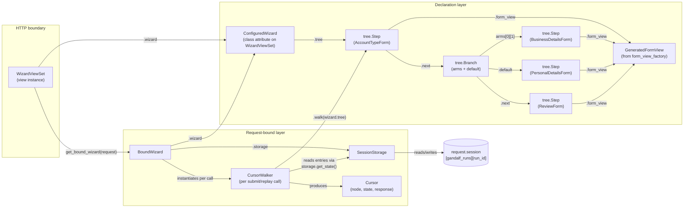
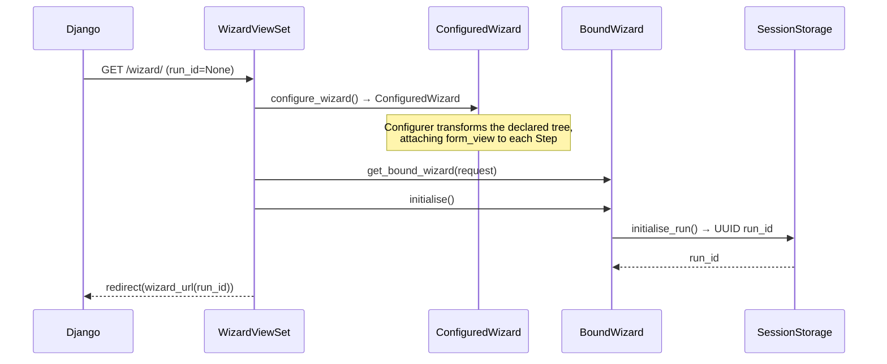
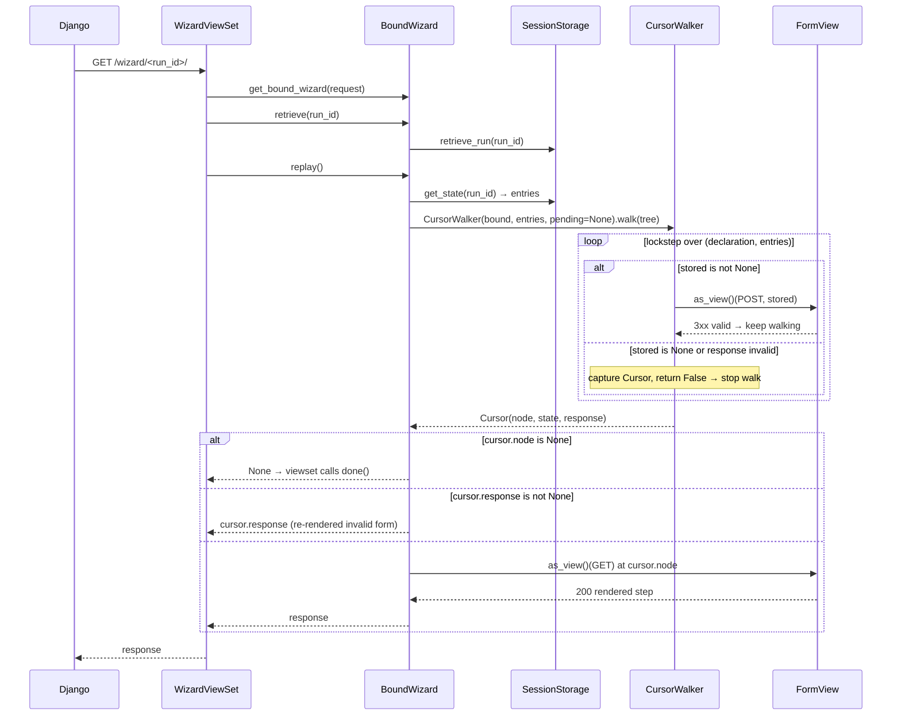

# Architecture

## Module map

| Module | Role |
|---|---|
| `gandalf/tree.py` | Immutable wizard tree — `Step` and `Branch` frozen dataclasses linked via `.next`; `build()` threads `next` from a flat declaration list. Also defines the four traversal kinds (`Visitor`, `Interpreter`, `Transformer`, `Reducer`), the `Configurer` transformer that attaches `form_view` classes to each `Step`, and the `Mermaid` renderer (`tree.mermaid()`) that emits a `flowchart TD` diagram of a declaration tree |
| `gandalf/wizard.py` | Declarative builder — `Wizard` (fluent `.step()` / `.branch()` API) and `ConfiguredWizard` (post-`.configure()`, holds the configured tree and pluggable class slots: `storage_class`, `runtime_tree_builder_class`, `cursor_walker_class`, `state_serializer_class`, `form_view_factory`) |
| `gandalf/form_views.py` | `form_view_factory()` — generates a `FormView` subclass from a plain `Form` class |
| `gandalf/storage.py` | `SessionStorage` — JSON persistence to `request.session`. Knows nothing about tree shape; reads and writes a `state` list per `run_id` |
| `gandalf/runtime.py` | Request-bound runtime. `BoundWizard` orchestrates `submit()` and `replay()`. `CursorWalker` (an `Interpreter`) locates the cursor and builds the runtime tree prefix in lockstep with stored entries. `RuntimeTreeBuilder` (an `Interpreter`) builds the full active-route runtime tree for introspection. `Cursor` is the decision object — `(node, state, response)`. `StateSerializer` (a `Reducer`) flattens a runtime tree back into the stored list shape. `RuntimeStep` / `RuntimeBranch` are the per-request mirrors of declared nodes |
| `gandalf/viewsets.py` | `WizardViewSet` — Django `View` subclass; HTTP boundary for GET and POST |

---

## The cursor: the central decision point

Every request that does real work reduces to "find the cursor, then act on its three fields":

```python
@dataclass(frozen=True)
class Cursor:
    node: tree.Step | None                            # which step the user is at
    state: RuntimeStep | RuntimeBranch | None         # the runtime tree built up to here
    response: Any = None                              # rendered invalid form, if stored data no longer validates
```

- `node is None` → wizard is complete; viewset calls `done()`.
- `response is not None` → re-validation of stored data failed; return that rendered response directly.
- otherwise → dispatch a GET to `node.form_view` to render the step.
- `state` is what `submit()` re-serializes back to storage to advance the wizard.

`CursorWalker` is the only thing that produces a `Cursor`. Every entry point below it (`BoundWizard.submit`, `BoundWizard.replay`) consumes one and switches on those fields.

---

## Object graph for one request



`form_view_factory()` produces one `GeneratedFormView` class per `Step`, but the diagram collapses them to a single node; each `Step.form_view` points to its own generated class.

`RuntimeTreeBuilder` is omitted from the diagram — it's a parallel `Interpreter` used by `BoundWizard.find_step()` / `filter_steps()` and by the `runtime_tree` property for introspection. It does not produce a cursor and is not on the submit/replay path.

---

## Request lifecycle

### GET — first visit (no `run_id`)



### GET — returning visit (with `run_id`)



### POST — step submission

```mermaid
sequenceDiagram
    participant Django
    participant WVS as WizardViewSet
    participant BW as BoundWizard
    participant SS as SessionStorage
    participant CWK as CursorWalker
    participant SER as StateSerializer
    participant FV as FormView

    Django->>WVS: POST /wizard/<run_id>/
    WVS->>BW: get_bound_wizard(request)
    WVS->>BW: retrieve(run_id)
    WVS->>BW: submit(request.POST.dict())
    BW->>SS: get_state(run_id) → old entries
    BW->>CWK: CursorWalker(bound, entries, pending=submission).walk(tree)
    Note over CWK: Same lockstep walk; on reaching the first empty slot,<br/>places pending submission at that slot and stops.
    CWK-->>BW: Cursor(node, state with submission placed, ...)
    BW->>SER: reduce(cursor.state) → new entries
    BW->>SS: set_state(run_id, new entries)

    WVS->>BW: replay()
    BW->>SS: get_state(run_id) → new entries
    BW->>CWK: CursorWalker(bound, entries, pending=None).walk(tree)
    CWK-->>BW: Cursor for next step
    alt cursor.node is None
        BW-->>WVS: None → viewset calls done()
    else
        BW->>FV: as_view()(GET) at cursor.node
        FV-->>BW: 200 rendered step
        BW-->>WVS: response
    end
    WVS-->>Django: response
```

A POST therefore walks the tree **twice**: once inside `submit()` to place the submission and persist, once inside `replay()` to find the next step to render. Both walks use the same `CursorWalker` class.

---

## State storage shape

State is stored in `request.session["gandalf_runs"][run_id]["state"]` as a list that **mirrors the shape of the wizard tree**. Each entry is one of:

```python
{"step": {…form_data…}}         # a tree.Step node — holds submitted form data
{"branch": [{…sub-entries…}]}   # a tree.Branch node — sub-entries record the taken arm
```

Branch decisions are **never persisted**. On every walk the active arm is re-derived by evaluating each branch predicate against the runtime-tree prefix built so far. `SessionStorage` is deliberately tree-shape-agnostic — it just reads and writes a list; the lockstep walk in `CursorWalker` / `RuntimeTreeBuilder` is what makes the list mean something.

Steps have no stable identifier. Alignment between declaration and stored entries is purely positional, which is why the stored shape must mirror the AST: each walker pops one entry per node as it descends.

### Example — branching wizard state after three steps

```python
# wizard declaration
from django import forms
from gandalf.wizard import Wizard, condition

wizard = (
    Wizard()
    .step(AccountTypeForm)
    .branch(
        condition(is_business, Wizard().step(BusinessDetailsForm)),
        default=Wizard().step(PersonalDetailsForm),
    )
    .step(ReviewForm)
).configure(template_name="wizard/step.html")
```

After the user completes all three steps via the business arm:

```python
[
    {"step": {"account_type": "business"}},
    {"branch": [{"step": {"business_name": "Acme Ltd"}}]},
    {"step": {"confirmed": True}},
]
```

---

## Branch arm selection

Branch predicates receive a wizard-shaped request whose `.wizard` attribute is the `BoundWizard` itself. From there they can inspect the runtime tree built so far via `find_step()` / `filter_steps()`:

```python
from gandalf.wizard import Wizard, condition

def is_business(request):
    step = request.wizard.find_step(step_name="account")
    return step.data["account_type"] == "business"

wizard = (
    Wizard()
    .step(AccountTypeForm, context={"step_name": "account"})
    .branch(
        condition(is_business, Wizard().step(BusinessDetailsForm)),
        default=Wizard().step(PersonalDetailsForm),
    )
    .step(ReviewForm)
)
```

`BoundWizard._select_branch_arm()` (called from inside both `CursorWalker` and `RuntimeTreeBuilder` when they hit a `tree.Branch`) temporarily sets `self._predicate_runtime_tree` to the partial runtime head built up to the branch, evaluates each arm predicate in declaration order, and returns the first matching arm's subtree or `Branch.default`. The partial-tree handoff is what lets predicates see prior answers without seeing future ones.
