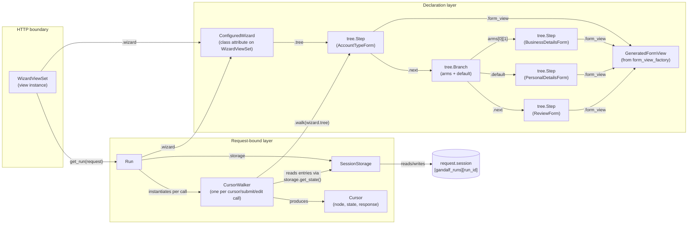
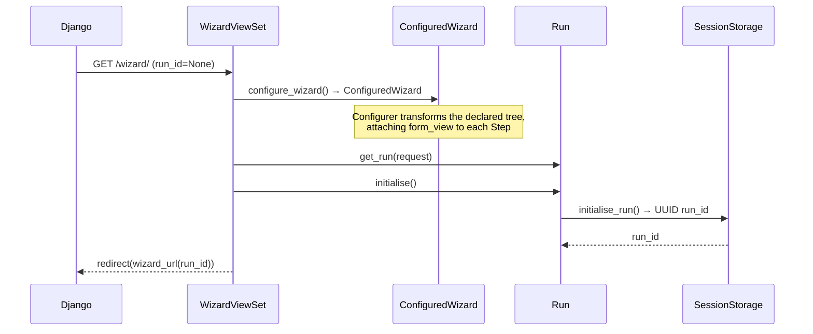
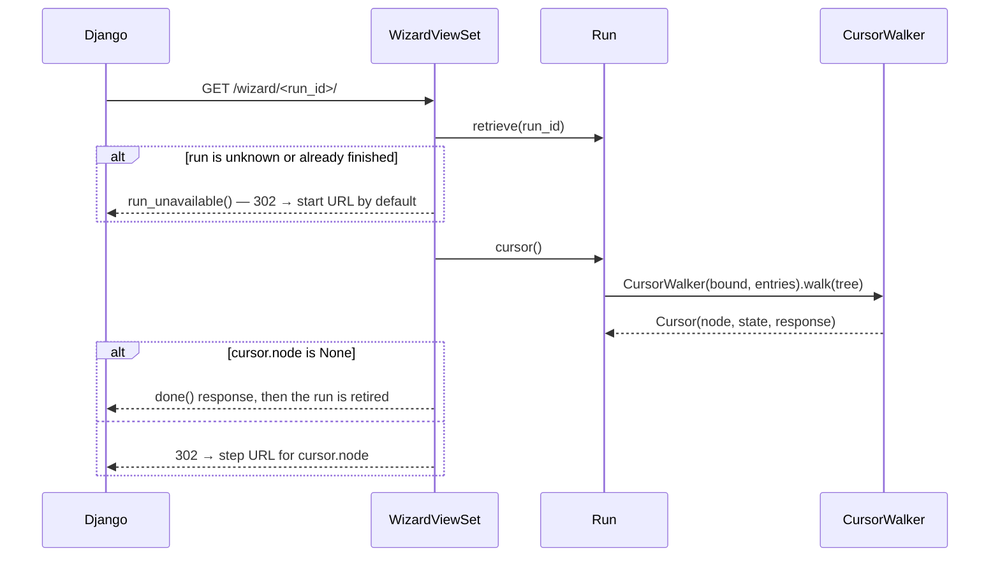
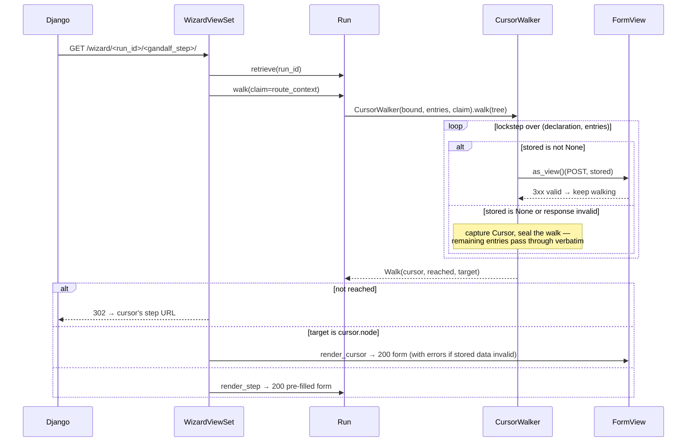

# Architecture

## Module map

| Module | Role |
|---|---|
| `gandalf/tree.py` | Immutable wizard tree — `Step` and `Branch` frozen dataclasses linked via `.next`; `build()` threads `next` from a flat declaration list. Also defines the four traversal kinds (`Visitor`, `Interpreter`, `Transformer`, `Reducer`) and the `Configurer` transformer that attaches `form_view` classes to each `Step` |
| `gandalf/wizard.py` | Declarative builder — `Wizard` (fluent `.step()` / `.branch()` API) and `ConfiguredWizard` (post-`.configure()`, holds the configured tree and pluggable class slots: `file_storage_class`, `cursor_walker_class`, `step_dispatcher_class`, `state_serializer_class`, `step_router_class`, `form_view_factory`). Storage is deliberately not among them — it lives on `WizardViewSet`, since it must exist before `get_wizard()` can be called |
| `gandalf/form_views.py` | `StepFormView` — the `FormView` base a step starts from, carrying the no-op `get_success_url()` the walk needs (it reads the status code and discards the response). `form_view_factory()` generates a `StepFormView` subclass from a plain `Form` class, so a generated step view and a user-written one are the same kind of thing |
| `gandalf/escapes.py` | The escape exceptions a step raises to leave the wizard — `Escape` (base) and `Park` / `Advance` / `Obliterate`, which differ in what they leave of the run |
| `gandalf/context.py` | `WizardContext` — the environment a walk runs in, and what branch predicates, expansion builders and switch selectors are handed. Carries the run (`.run`, what `request.wizard` used to be), whoever is answering (`.actor`), where state is kept (`.session`), the mount kwargs (`.url_kwargs`), and the browser's request (`.request`) when there is one — `None` when there is not, which is the honest answer rather than a fabricated request that answers wrongly. `http_request()` is the single place a request is built, because dispatching a step's `FormView` means calling a Django view and a Django view takes one |
| `gandalf/storage.py` | `SessionStorage` — JSON persistence to `context.session`. Knows nothing about tree shape; reads and writes a `state` list per `run_id`, swaps it for a completion marker when a run finishes (keeping the run's metadata bag, which describes what the run did *outside* itself and so outlives the answers), and raises `RunNotFound` for a run the session does not hold. `get_run_metadata` / `set_run_metadata` are the second, smaller seam: written through on every change rather than at the end of a walk, because the callers that use them — `run_started()`, a step view on a GET — are ones no walk will persist for. Also `SessionStashStore` — keyed stash payloads (`put` / `get` / `has` / `pop` / `delete` / `keys`, raising `StashNotFound`) kept under its own session key by default or, given a `home` pair of read/write callables, wherever the caller says: the shipped home for hand-kept `Run.stash()` output *and* the payload half of every `SessionJourneyStore`, which points it at the journey's record. `SessionJourneyStore(context, journey)` is one journey's bookkeeping, everything under one record per journey: the two mappings a task list needs — section key to live run id, and section key to stash payload — because they answer different questions and outlive each other (a run id is cleared when a section finishes, a payload *is* the finishing); `data`, the journey's decided facts as a `JourneyData` bag (a `MetadataBag` with `for_member()` sub-bags); and the journey's own `complete()` / `is_complete()`, which discards runs and stashes, keeps the data, and leaves a tombstone pruned to the ten most recent. `SessionCollectionStore` extends it with the one thing an add-another list needs and neither mapping can supply: an ordered registry of item ids per list, each carrying the title its own item cached at completion, plus whether the user has said there are no more to add. The contract is `gandalf.types.JourneyStore` / `CollectionStore` |
| `gandalf/metadata.py` | `MetadataBag` — a JSON-safe `MutableMapping` over one bucket of a stored envelope, behind a reader and a writer, written through on every assignment: deep-copied reads, `update()` for one write of several keys, never memoised. `RunMetadata` (a run's record of what it did elsewhere) and `JourneyData` (what a journey's sections decided) are both this with their own buckets named |
| `gandalf/runtime.py` | Request-bound runtime. `Run.walk()` is the single operation: replay stored answers, put a submission at the step a claim names, stop where it stops. `cursor()` and `render_step()` are callers of it. `CursorWalker` (an `Interpreter`) locates the cursor and builds the one runtime tree everything uses — validated up to the cursor, carried verbatim past it; `runtime_tree` and `path` (which carries `find_step` / `filter_steps`) all derive from it. `Cursor` is the decision object — `(node, state, response, escapes)`. `StateSerializer` (a `Reducer`) flattens a runtime tree back into the stored list shape. `RuntimeStep` / `RuntimeBranch` are the per-request mirrors of declared nodes — a `RuntimeStep` also carries its own `name` and `url` (via `Run.step_url`), and reconstructs `form` at most once per node, so repeated reads of one step's answers cost one validation; `PreservedBranch` is the opaque passthrough for branch entries positioned after the cursor. `Run.stash()` wraps the stored state (file refs stripped) in a versioned envelope for the caller to keep, with the run's metadata riding along — a file ref names bytes completion deletes, a record id names something that outlives the run; `resurrect()` vets a payload (`InvalidStash`) and seeds a fresh run from it. `RunMetadata` is the run's bag of what it did elsewhere — a `MutableMapping` over its own storage seam, deliberately *not* in the positional state list, because a walk persists nothing and every request replays every stored answer through its real `FormView`; `for_step(name)` namespaces a sub-bag per step |
| `gandalf/summary.py` | `SummaryMixin` — check-your-answers rows for a summary step. Mixed into a step's `FormView`, it puts one `SummaryRow` per answered step of `path` in the template context, each carrying the step's label, its answers as display text (`format_value`: choice labels, Yes/No, localized dates, upload filenames) and the step's own URL. Purely a view-layer reader: it derives everything from the runtime and knows nothing about storage or the walk. It drops the step doing the summarising (`Run.rendering`) from its own rows, which matters once a run has been round the houses — a revisited edit or a re-opened stash arrives with that answer stored too. `summary_fields` shapes a row declaratively rather than by dispatching on step name: a mapping of step name to `Group` / `Hide` specs, folded over the form's own fields, so a group replaces the first of its fields and swallows the rest while everything unnamed keeps a line. A key naming no *declared* step is refused, since a rename would otherwise revert a page silently; the declaration rather than the route, so a dormant arm's step is a legitimate key, and a wizard carrying an `Expand` is exempt because its names do not exist until the walk grows them |
| `gandalf/tasklists.py` | Task lists — `TaskList` is the declaration: a class body of entries (`Section`, `AddAnother`, `Group`, `Link`), the attribute name the key and the body's order the page's. A value, not a view, so `GrantApplication.begin(request)` can start a journey from anywhere. An entry carries facts (a title, the step a finished section re-opens at, a stash label); the thing in its slot carries behaviour — a `Wizard` the library wraps, or a `SectionViewSet` subclass with `run_done()` and the `blocked()` / `hidden()` classmethods on it. `TaskListViewSet` is the page, the door and the mount: set `task_list` and `url_name`, and at class creation `materialise()` builds one `SectionViewSet` subclass per section (carrying the wizard, the full key, the page's URL name and both stores), one `AddAnotherViewSet` per add-another entry, and one subclass of the root itself per group — so a hook overridden on the root applies to the whole tree — and `urls()` mounts all of them beneath the page, door last. Nothing is declared twice, so nothing is checked for drift. The page puts a `TaskListPage` in the template context: one `Row` per entry, each carrying a title, a status (`NOT_STARTED` / `INCOMPLETE` / `COMPLETE` / `BLOCKED`) and the page's own door URL, plus the counts and the derived status of the set. Rows are built once per request. Status is derived from the *shape* of stored state and the presence of a stash, so a row costs storage reads and never a walk. Whether a section is open yet, and whether it is listed at all, are the section viewset's `blocked()` and `hidden()` — one read of the journey's store each — consulted through `entry_blocked()` / `entry_hidden()`, the page's hooks for a rule spanning rows: blocked makes a row read **Cannot start yet** *and* makes the door refuse it; hidden removes the entry from `_vetted_entries()` so it is absent from the rows, the counts and the door alike. The page is scoped to a *journey* (`get_journey()`: a URL kwarg when mounted under one, else the declared `journey`), and because every entry is mounted beneath it the page's own URL kwargs reach every entry URL (`entry_url_kwargs()`). It owns an ending: `submit()` refuses an incomplete page, then a group's page runs `group_done()` and returns to its parent while a root runs `journey_done()`, then `store.complete()`; `dispatch()` answers a tombstoned journey with `submitted()` at the root and a redirect up everywhere beneath it. The door (`enter()`) is where the one unavoidable walk happens, for the section the user clicked: it resumes a live run, re-opens a stash, or starts a fresh one, and every arm ends at `Run.entry_url()` — and since a section's bare URL *is* the door, no link can ever be a bare run URL. `SectionViewSet.done()` stashes the finished answers, calls `run_recorded()` (the library's own bookkeeping, inside the window where the run is still readable), then `run_done()`, then clears the run. `Journey`, from `begin()`, is the handle a start wizard uses: `finish(section, run)` runs that same `done()` under a new id. A `Link` has no viewset: given `url_name` and `status`, its row links past the door to something the page does not run |
| `gandalf/add_another.py` | Add another — `AddAnother(wizard, ...)` is the entry (item name, what titles an item, `min_items`, the step an item re-opens at, its two templates), declared in a `TaskList` body or set as `add_another` on a root `AddAnotherViewSet`. An add-another page is a task list whose entries are *built* from `SessionCollectionStore`'s registry rather than declared, so `AddAnotherViewSet` extends `TaskListViewSet` and inherits the status derivation, the row building and the resume-before-reopen door unchanged; at class creation it builds one `ItemViewSet` subclass from the entry's wizard and mounts it beneath the item door. What is its own: an item's key is composed per request from a URL kwarg (keyed `<list>:<item>`), its title is cached at completion rather than derived at render, completeness is the user's declared answer to *add another* rather than anything storage can infer — which is why the page suppresses the task list's own context object and publishes only `items`, rather than carry two differently-derived statuses for one page — and the page owns four actions instead of one door — add, change, remove, declare. An item's behaviour — saving it in `run_done()`, forgetting it in `item_removed()` — lives on an `ItemViewSet` subclass in the entry's slot, beside its wizard. `AddAnotherPage` *is* a `TaskListPage` — same rows, same status, same counts — plus what a task list has no notion of: where the page is, whether the user has declared there are no more, and `min_items`. `urls()` publishes the page (GET lists, POST answers), the item door (GET only, since the route that destroys an item is the other one), the remove route, and the item wizard's run routes beneath the door |
| `gandalf/viewsets.py` | `WizardViewSet` — Django `View` subclass; HTTP boundary for GET and POST. Every request routes through step URLs (`_routed_get` / `_routed_post`); `urls()` publishes the patterns from `url_name`, and `get_start_url` / `get_wizard_url` / `get_step_url` reverse them. `begin()` / `inspect()` / `reopen()` bind a wizard outside its own dispatch — the retrieve-then-resolve ordering a dynamic `get_wizard()` depends on — and `resurrect()` is `reopen()` plus `entry_url()`. `_begin()` is the single door a *fresh* run comes through (both `begin_for()` and the bare start URL), which is what lets `run_started()` promise to fire exactly once per run; `reopen()` does not call it, because a resurrected run is a continuation whose metadata came back with its answers |

---

## The cursor: the central decision point

Every request that does real work reduces to "find the cursor, then act on its fields":

```python
@dataclass(frozen=True)
class Cursor:
    node: tree.Step | None                            # which step the user is at
    state: RuntimeStep | RuntimeBranch | None         # the full runtime tree for this walk
    response: Any = None                              # rendered invalid form, if stored data no longer validates
    escapes: tuple = ()                               # (declaration, Escape) pairs raised on this walk
```

- `node is None` → wizard is complete; viewset calls `done()` and retires the run, so it fires exactly once.
- `response is not None` → re-validation of stored data failed; return that rendered response directly.
- otherwise → dispatch a GET to `node.form_view` to render the step.
- `state` is what `submit()` re-serializes back to storage to advance the wizard. It spans the whole declaration tree: entries before the cursor are validated, the cursor's slot holds the pending submission (or the kept invalid/missing data), and entries after the cursor ride along verbatim so answers past the cursor are never lost.
- `escapes` records steps that raised an `Escape` while validating. An escape satisfies its step, so the walk continues; the viewset consults `escape_for(declaration)` for the step just submitted and redirects out of the wizard if it finds one.

`CursorWalker` is the only thing that produces a `Cursor`. `Run.walk()` is the only thing that drives it, and everything else — `cursor()`, `render_step()`, the viewset's GET and POST — is a caller of that one walk.

---

## Object graph for one request


```mermaid
graph LR
    subgraph HTTP boundary
        WVS["WizardViewSet\n(view instance)"]
    end

    subgraph Declaration layer
        CW["ConfiguredWizard\n(class attribute on WizardViewSet)"]
        S1["tree.Step\n(AccountTypeForm)"]
        BR["tree.Branch\n(arms + default)"]
        S2a["tree.Step\n(BusinessDetailsForm)"]
        S2b["tree.Step\n(PersonalDetailsForm)"]
        S3["tree.Step\n(ReviewForm)"]
        FV["GeneratedFormView\n(from form_view_factory)"]
    end

    subgraph Request-bound layer
        BW["Run"]
        SS["SessionStorage"]
        CWK["CursorWalker\n(one per cursor/submit/edit call)"]
        CUR["Cursor\n(node, state, response)"]
    end

    Session[("request.session\n[gandalf_runs][run_id]")]

    WVS -->|".wizard"| CW
    CW -->|".tree"| S1
    S1 -->|".next"| BR
    BR -->|"arms[0][1]"| S2a
    BR -->|".default"| S2b
    BR -->|".next"| S3
    S1 -->|".form_view"| FV
    S2a -->|".form_view"| FV
    S2b -->|".form_view"| FV
    S3 -->|".form_view"| FV

    WVS -->|"get_run(request)"| BW
    BW -->|".wizard"| CW
    BW -->|".storage"| SS
    BW -->|"instantiates per call"| CWK
    CWK -->|".walk(wizard.tree)"| S1
    CWK -->|"produces"| CUR
    SS -->|"reads/writes"| Session
    CWK -->|"reads entries via\nstorage.get_state()"| SS
```

`form_view_factory()` produces one `GeneratedFormView` class per `Step`, but the diagram collapses them to a single node; each `Step.form_view` points to its own generated class.

The `runtime_tree` property (and `path`, with its `find_step` / `filter_steps`, on top of it) is the same walk: it reuses the render context's cursor when the viewset recorded one, and performs one `CursorWalker` pass otherwise. There is no separate introspection builder.

---

## Request lifecycle

### GET — first visit (no `run_id`)


```mermaid
sequenceDiagram
    participant Django
    participant WVS as WizardViewSet
    participant CW as ConfiguredWizard
    participant BW as Run
    participant SS as SessionStorage

    Django->>WVS: GET /wizard/  (run_id=None)
    WVS->>CW: configure_wizard() → ConfiguredWizard
    Note over CW: Configurer transforms the declared tree,<br/>attaching form_view to each Step
    WVS->>BW: get_run(request)
    WVS->>BW: initialise()
    BW->>SS: initialise_run() → UUID run_id
    SS-->>BW: run_id
    WVS-->>Django: redirect(wizard_url(run_id))
```

### GET — bare run URL (with `run_id`, no step segment)


```mermaid
sequenceDiagram
    participant Django
    participant WVS as WizardViewSet
    participant BW as Run
    participant CWK as CursorWalker

    Django->>WVS: GET /wizard/<run_id>/
    WVS->>BW: retrieve(run_id)
    alt run is unknown or already finished
        WVS-->>Django: run_unavailable() — 302 → start URL by default
    end
    WVS->>BW: cursor()
    BW->>CWK: CursorWalker(bound, entries).walk(tree)
    CWK-->>BW: Cursor(node, state, response)
    alt cursor.node is None
        WVS-->>Django: done() response, then the run is retired
    else
        WVS-->>Django: 302 → step URL for cursor.node
    end
```

The left-hand branch is why **nothing outside the wizard may link to a bare run
URL**. A GET here completes a run whose every stored answer validates, firing
`done()` and its side effects before the user has touched anything — and that
state is reachable more ways than it looks: a resurrected stash, a step that
raised `Advance` at the end of the tree (persisting without ever reaching
`_finish`), or a dynamic `get_wizard()` that shrank its tree between requests.
`Run.entry_url()` exists for every caller outside the dispatch — task list
rows, resurrections, links in email — and names a step instead: the cursor's,
or for a fully-valid run the first on the active route. It falls back to the
bare run URL only for a wizard with no steps at all, where there is nothing to
fire either.

### GET — step URL


```mermaid
sequenceDiagram
    participant Django
    participant WVS as WizardViewSet
    participant BW as Run
    participant CWK as CursorWalker
    participant FV as FormView

    Django->>WVS: GET /wizard/<run_id>/<gandalf_step>/
    WVS->>BW: retrieve(run_id)
    WVS->>BW: walk(claim=route_context)
    BW->>CWK: CursorWalker(bound, entries, claim).walk(tree)
    loop lockstep over (declaration, entries)
        alt stored is not None
            CWK->>FV: as_view()(POST, stored)
            FV-->>CWK: 3xx valid → keep walking
        else stored is None or response invalid
            Note over CWK: capture Cursor, seal the walk —<br/>remaining entries pass through verbatim
        end
    end
    CWK-->>BW: Walk(cursor, reached, target)
    alt not reached
        WVS-->>Django: 302 → cursor's step URL
    else target is cursor.node
        WVS->>FV: render_cursor → 200 form (with errors if stored data invalid)
    else
        WVS->>BW: render_step → 200 pre-filled form
    end
```

### POST — step URL

```mermaid
sequenceDiagram
    participant Django
    participant WVS as WizardViewSet
    participant BW as Run
    participant SS as SessionStorage
    participant CWK as CursorWalker
    participant SER as StateSerializer

    Django->>WVS: POST /wizard/<run_id>/<gandalf_step>/
    WVS->>BW: retrieve(run_id)
    WVS->>BW: walk(claim=route_context, submission=submission_from_post(request.POST))
    Note over CWK: replay stored answers; at the claimed step put the<br/>submission there instead; carry on; stop where it stops
    CWK-->>BW: Walk(cursor, reached, target)
    alt not reached
        WVS-->>Django: 302 → cursor's step URL (nothing stored)
    end
    alt the submitted step escaped
        Note over WVS: settle the run per the escape — nothing is written yet,<br/>so Park simply declines to persist, Obliterate deletes<br/>the run, and Advance persists
        WVS-->>Django: 302 → the escape's target
    end
    WVS->>BW: persist(walk)
    BW->>SER: reduce(walk.cursor.state) → new entries
    BW->>SS: set_state(run_id, new entries)
    Note over WVS: re-resolve the wizard; only if it comes back a<br/>different object (a dynamic get_wizard()) is a second<br/>walk needed to judge completion
    WVS->>BW: cursor()
    alt next cursor.node is None
        WVS-->>Django: done() response, then the run is retired
    else
        WVS-->>Django: 302 → next cursor's step URL (PRG)
    end
```

A POST therefore walks the tree **once**, and the follow-up GET walks once more to render. There is no separate submit and edit path: placing an answer at a step is one operation, and whether that step already had an answer changes nothing about the mechanics.

The invariant that follows is worth holding on to while debugging:

> The walk runs a form's `clean()` **once per completed step per HTTP request** — and each step whose answers the request *reads back* costs one more.

So with `k` answers already stored a POST costs `k+1` validations — the `k` replays plus one live dispatch of the answer just submitted — and the follow-up GET costs `k+1` again, because it is a separate request that has to re-derive position from stored state. Completing an `N`-step run therefore costs `N²` validations in total. `tests/functional/test_walk_cost.py` asserts these counts exactly, and `benchmarks/` (`just bench`) measures them across shapes and sizes.

The second clause is the price of reading. Proving an answer and *displaying* it are separate passes over the same form: the walk dispatches the step's view to prove it, while `RuntimeStep.form` reconstructs a form and validates it to hand back `cleaned_data`. A check-your-answers page therefore costs **two validations per answered step** — one to prove, one to display — and a branch predicate that dereferences an earlier answer costs one for the step it reads, on every request that resolves that arm.

Two shapes to keep in mind when reading answers back:

- **Within a render**, `path` reuses the cursor the viewset recorded, so a fresh access re-walks nothing — but `PathFlattener` rebuilds the step nodes, and a rebuilt node has lost the memoised form. Re-reading `wizard.path` per field therefore costs another validation per step per read. Hold the steps you are iterating.
- **Outside a render** — `done()`, a completion page, a driver reading a run — there is no recorded cursor to reuse, so *every* `path` access walks. Looking each of `k` steps up separately costs `k²` validations in that one request, where iterating once costs `k`.

A **dynamic** `get_wizard()` is the one case that needs a second walk. It derives the tree from stored state, so the answer just written can imply steps that did not exist when the request began; judging completion against the pre-write tree would fire `done()` mid-run. `_refreshed_cursor` re-resolves the wizard and only walks again when that hands back a different object, so a static wizard never pays for it.

Note the ordering: nothing is persisted until the walk has finished, so an `Escape` is settled before any write. `Park` simply declines to persist rather than having to undo a write. `CursorWalker` catches escapes uniformly and records them on the `Cursor`; a caught escape marks its step satisfied, so replays of a stored escaping answer keep walking. Only the viewset acts on one, and only for the step just submitted — but it acts wherever that step sits, since there is no longer an edit path for a disposition to be defined against.

---

## State storage shape

State is stored in `request.session["gandalf_runs"][run_id]["state"]` as a list that **mirrors the shape of the wizard tree**. Each entry is one of:

```python
{"step": {…form_data…}}                        # a tree.Step node — holds submitted form data
{"step": None}                                 # a hole — the slot exists but has no valid answer yet
{"branch": {"<arm_id>": [{…sub-entries…}]}}    # a tree.Branch node — sub-entries keyed per arm
```

A step's form data is the submission flattened out of the POST `QueryDict`: a key the browser sent more than once (`CheckboxSelectMultiple` renders one input per selected value) stores the full list of values, and every other key stores its single value. Replay rebuilds a `QueryDict` from the stored mapping before it reaches a form, so widgets keep their `getlist` semantics and a multi-valued field reads a list back even when only one value was submitted.

Branch entries are keyed by arm id — the arm's declaration-order index as a string, or `"default"`. The active arm's answers live under its key; other keys are **dormant memory**: they are carried verbatim (never validated, never descended into) so that changing a branch answer parks the old arm's data instead of discarding it, and flipping back restores it. A missing key means that arm has never been answered. Bare-list branch entries (the pre-per-arm shape) are still read, treated as belonging to whichever arm is derived on that walk — a best-effort adoption: a request-dependent predicate (user role, feature flag) that derives a different arm than the legacy entries were recorded under will misattribute them, the same exposure the pre-per-arm code had.

Branch **decisions** are still never persisted. On every walk the active arm is re-derived by evaluating each branch predicate against the runtime-tree prefix built so far; the arm id only keys which stored memory is live. `SessionStorage` is deliberately tree-shape-agnostic — it just reads and writes a list; the lockstep walk in `CursorWalker` is what makes the list mean something.

Steps have no stable identifier. Alignment between declaration and stored entries is purely positional, which is why the stored shape must mirror the AST: each walker pops one entry per node as it descends. (Arm ids are positional too — a dynamic `get_wizard()` that reorders branch arms between requests can misattribute dormant memory, the same way reordering steps misaligns entries.)

The list is a **full-tree mirror with holes**, not a prefix. `CursorWalker` validates entries until it finds the cursor (the first missing or no-longer-valid answer), then *seals*: remaining step entries are carried verbatim and remaining branch entries become opaque `PreservedBranch` passthroughs (no arm is derived there — predicates might depend on the missing answer). Serializing the walk therefore keeps every answer positioned after the cursor. An entry that no longer validates keeps its data and replays as the errored form for correction. `StateSerializer` trims trailing holes and omits empty arms at every level, so simple linear progress still stores the same minimal prefix it always did.

The run's **metadata bag** is deliberately not in this list. A step entry's `"meta"` describes the *placement* — who answered it and how — and is replaced by the next placement at that step. What a run did outside itself (a record it opened, a call it made) is a different fact with a different lifetime, so it is stored beside the state under `RunData["meta"]`, as `{"run": {...}, "steps": {"<name>": {...}}}`, and reached through `get_run_metadata` / `set_run_metadata`. Three properties of the list make that necessary rather than tidier: a walk persists nothing (only its caller may `persist()`, and a GET never does, yet a GET still replays every stored answer through its real `FormView`); `StateSerializer` rewrites the list wholesale on every persist; and a placement replaces the `"meta"` beside it. `RunMetadata` writes through on every assignment for exactly those reasons.

A **stash payload** (`Run.stash()`) reuses this exact entry shape: `{"version": 1, "label"?: ..., "state": [...], "meta"?: {...}}` where `state` is the stored list with every `files` key stripped (uploads do not outlive completion) and `meta` is the run's bag, which does ride along — a file ref names bytes completion deletes, a record id names something that outlives the run entirely. Resurrection (`resurrect()`) is just `initialise_run()` + `set_state()` with a deep copy of that list (plus `set_run_metadata()` when the payload carries a bag) — the lockstep walk then re-proves every answer, so a stash is trusted no further than a live run's own state, and the positional-alignment caveats above apply to stashes across deploys just as they do to live sessions.

### Example — branching wizard state after three steps

```python
# wizard declaration
from django import forms
from gandalf.wizard import Wizard, condition

wizard = (
    Wizard()
    .step(AccountTypeForm)
    .branch(
        condition(is_business, Wizard().step(BusinessDetailsForm)),
        default=Wizard().step(PersonalDetailsForm),
    )
    .step(ReviewForm)
).configure(template_name="wizard/step.html")
```

After the user completes all three steps via the business arm:

```python
[
    {"step": {"account_type": "business"}},
    {"branch": {"0": [{"step": {"business_name": "Acme Ltd"}}]}},
    {"step": {"confirmed": True}},
]
```

If the user then edits the first answer to `personal`, the business arm goes dormant and the confirmed review answer is preserved; only the personal arm's step is asked before the wizard is complete again:

```python
[
    {"step": {"account_type": "personal"}},
    {"branch": {"0": [{"step": {"business_name": "Acme Ltd"}}]}},
    {"step": {"confirmed": True}},
]
```

---

## Branch arm selection

Branch predicates receive the run's `WizardContext`, whose `.run` attribute is the `Run` itself. From there they can inspect the validated prefix built so far via `context.run.path.find_step()` / `path.filter_steps()` — `path` is predicate-aware, so mid-walk it is the answered steps up to the branch. A context is not a request: it carries the run, the actor and the session, and is equally true of a run being driven by `gandalf.driver` with no browser anywhere:

```python
from gandalf.wizard import Wizard, condition

def is_business(context):
    step = context.run.path.find_step(name="account")
    return step.data["account_type"] == "business"

wizard = (
    Wizard()
    .step(AccountTypeForm, name="account")
    .branch(
        condition(is_business, Wizard().step(BusinessDetailsForm)),
        default=Wizard().step(PersonalDetailsForm),
    )
    .step(ReviewForm)
)
```

`Run._select_branch_arm()` (called from inside `CursorWalker` when it hits a `tree.Branch`) enters `Run.walking()` with the partial runtime head built up to the branch, evaluates each arm predicate in declaration order, and returns `(arm_id, subtree)` for the first matching arm — or `("default", Branch.default)`. The partial-tree handoff is what lets predicates see prior answers without seeing future ones; the arm id keys which per-arm memory in the branch's stored entry is live for this walk.

This yields a guarantee: because the sealed walk is the only thing that ever selects arms, **a branch predicate only ever runs behind a fully-validated prefix** — every step before the branch is answered and currently valid when the predicate executes. Predicates can dereference prior answers (`path.find_step(...).data["key"]`) unconditionally. The corollary is that steps off the resolved route are invisible to `path.find_step`: it returns `None` for the current unanswered step, any step not yet reached, and steps inside a branch whose arm cannot be derived yet.

### The `walking()` handoff

`walking(partial_runtime_head)` is what makes any of those reads possible. While it is held, `runtime_tree` (and therefore `path`) resolves to the prefix validated so far instead of walking the run afresh. Three callers enter it, all from inside `CursorWalker`:

- `_select_branch_arm()`, around the arm predicates;
- `_build_expansion()`, around the expansion builder;
- `CursorWalker._satisfies()`, around the step-view dispatch that validates a stored answer.

The third is the one that makes a user-supplied step `FormView` safe. `.form` reconstruction and step dispatch drive the view's composition hooks (`get_form_class()`, `get_form_kwargs()`, `get_initial()`, `get_prefix()`), so a view that reads `request.wizard` there is reading *from inside* a walk. Without the handoff that read starts a nested walk, which dispatches the same view, which reads again — unbounded recursion. With it, the read sees the prefix already validated on this walk.

The sentinel matters: "no walk in progress" is `_NO_WALK`, not `None`, because `None` is a legitimate partial head — the prefix before the first step, and before a branch or expansion in first position, is empty. Conflating the two sends exactly those reads off to start a nested walk.

---

## One form builder, four readers

`RuntimeStep.form` does not construct a form. It drives the step's own
`FormView` through that view's public composition API — `get_form_class()`,
`get_form_kwargs()`, `get_initial()`, `get_prefix()` — from a request built
out of `run.request`, which is the *current* request.
`RunDriver._unbound_form` reaches for the same door when it builds a schema.

Four things therefore come from one place:

| Reader | Gets there via |
|---|---|
| the step page | ordinary `FormView` dispatch |
| the check-your-answers page | `SummaryRow.form` → `RuntimeStep.form` |
| `form_json_schema()`, and so `RunDriver.describe()` | `_view_for` → `get_form()` |
| an agent, which is told what `describe()` says | the same schema |

The consequence worth knowing: a `FormView` that overrides `get_form()` to
change a form per request — re-labelling a field, narrowing a queryset,
swapping a widget — changes all four together, and cannot change one
without the others. That is usually what you want, and it is the reason an
application can adapt how a step *reads* without the library growing a
setting for it. It is also why such an override must be cheap: the summary
page runs it once per answered step.

## Step URL routing

Steps are addressed by URL — there is no unrouted mode. `StepNameRouter` (`gandalf/wizard.py`, the `step_router_class` slot) maps the `gandalf_step` URL kwarg to a step-context lookup and reverses a step declaration back into a URL segment (`name` context by default; subclass to route on another key). The viewset validates at request time that the configured router can reverse every declared step, raising `ImproperlyConfigured` for unnamed steps.

On a step-URL request the viewset hands the claim to the walk. Reaching the claimed step *is* the authorisation: the walk only arrives there by validating everything before it, so a URL naming a step this run cannot reach — unknown, not yet reached, or parked in a dormant arm — never becomes a placement, and redirects to the cursor's URL instead. A reached step renders (pre-filled if it already has an answer) or takes the submission. The bare run URL redirects to the cursor's step URL (or fires `done()` on completion), and a bare-URL POST redirects without storing. Successful POSTs redirect (POST→redirect→GET); the URL is never trusted to *set* position, only checked against the derived cursor.

All of that presumes a live run. A run that is finished — or one the session never held — is intercepted before the wizard is even resolved (a completed run has no state left, and a dynamic `get_wizard()` is entitled to read state), and answered by `WizardViewSet.run_unavailable(run, reason)`. That single interception is what makes `done()` exactly-once: no URL under a retired run can reach the cursor machinery again.

---

## Add another: many runs behind one page

A task list's sections are declared, so its store never has to enumerate them. An add-another list's are not — the user grows the list — and no reading of runs or stashes can hand the list back: the stash key space holds only the items that have *finished*, in the order they finished rather than the order they were made. So the registry is written down explicitly (`SessionCollectionStore`, keyed per list, ordered, one entry per item). An item exists from the moment it is registered, which is the whole reason a half-finished item can have a row at all.

`AddAnotherViewSet.get_entries()` turns that registry into one bound `Section` per id, and past that point everything is `TaskListViewSet`'s: `get_entry_status()` reads the same two storage slots, and `enter()` resumes, re-opens or starts exactly as it does for a declared section. An item's run and stash live under a composite key the *view* composes (`"<list>:<item>"`) and the store never learns the scheme, so a task list's store and an add-another page's store share one key space and one contract.

Three consequences follow from "a row is a thing the user can destroy":

**One walk per completion, none per render.** The page's central bargain is that a row costs storage reads and never a walk; a CRUD list that cannot name its rows is useless, and naming one from stored answers means walking them. The walk is therefore paid once, at completion, inside `SectionViewSet.done()`'s readable window (via `run_recorded()`), on a request that has already walked twice — and the cached string is what every later render reads. `WizardViewSet.finish()` tears the run's state down after `done()` returns, so there is no later moment at which it could be paid.

**Completeness is declared.** Nothing in storage can distinguish "I have added all my guests" from "I have added one so far", so the page asks and the answer is stored. Adding withdraws it — pressing Add *is* the user changing their answer — while removing does not, because removal answers no question. Declaring is necessary but not sufficient: a list with an unfinished item, or fewer than `min_items`, still reports Incomplete.

**Removal runs inside-out.** `remove_item()` destroys everything reachable *through* the registry before the registry entry itself — the run, the run pointer, the stash, the cached title, then the item's own `item_removed()` — so a hook that raises leaves the item still listed and still removable rather than vanished with its side effects intact.

**Three routes, and the item wizard beneath them.** The page publishes itself, `<uuid:item>/` and `<uuid:item>/remove/`, then the item wizard's run routes under `<uuid:item>/`. The item kwarg is a uuid rather than a slug precisely so `remove/` can be a sibling of the door. The item wizard's bare start URL — the one that would complete a valid run on a GET — is deliberately not published: the door occupies that path, so the page owns every URL an item has. The same shape holds one level up: a task list mounts each entry under its own segment and publishes its `<slug:entry>/` door *last*, so an add-another page's or a group's segment is reached directly and a section's segment is the door under the section's own URL name.

## A journey: what the sections add up to

A task list's sections add up to something — an application, a claim — and that something needs three things no single wizard has: a scope, a memory and an ending. Every section has the first two through its journey store, and the *root* task list — the one no list lists — owns the third, which is why `SessionJourneyStore` is built with a `journey` as well as a context.

**Scope is the store's, identity is the URL's.** Everything a page keeps sits under one record per journey (`session["gandalf_journeys"][journey]`), so two journeys in one session never see each other. The library does not decide when a journey begins: the first wizard's `done()` does — `GrantApplication.begin(request)` hands back a `Journey` with a new id, its store and its page URL, and `finish()` records that wizard's run as a section of it — and puts the id in the URL. A page mounted under `<journey>` reads it off `self.kwargs` and, since every entry is mounted beneath it and built with the same `(journey, journey_url_kwarg)`, every entry reads the same one. A page mounted under nothing declares `journey = "default"` — one per session. `begin()` is asked of the `TaskList` value, not the view: a journey is a record in a store, and anything may begin one; the page only shows and ends one.

**The memory is the add-another bargain generalised.** An add-another page caches an item's title at completion so a row never walks; `store.data` does the same for any fact the journey turns on. A stash is positional against an unwalked tree, so "did they say they are employed?" costs a walk to read out of one — and `blocked()` and `hidden()` run inside the row's no-walk promise. So the section's `run_done()` pays the walk once, while the run is still readable, and writes the decided fact; every later render reads a string. `JourneyData` is `MetadataBag` with a `journey` bucket and a `members` bucket, the same two-bucket shape `RunMetadata` has for the same reason.

**Hidden is gone; blocked is waiting.** A section's `hidden()` is applied in `_vetted_entries()`, so a hidden section is absent from the rows, the counts and the door — a stale link hits `EntryNotFound` like any undeclared key. `blocked()` keeps the row, locks it, and holds the page off `COMPLETE`. Hidden outranks blocked by construction: a section that is not there is never asked. Both are classmethods handed the store and nothing else — the row's no-walk promise, made explicit in the signature; the page-side `entry_blocked()` / `entry_hidden()` have the request for a rule spanning rows.

**The ending mirrors `done()`.** `submit()` refuses an incomplete page, runs `journey_done()` inside the window where the stashes are still readable, and only then `store.complete()` — the runs and stashes go, `data` stays, a tombstone remains — so a `journey_done()` that raises leaves every section resumable. After that, `JourneyScoped.dispatch()` answers the root's page and doors with `submitted()`, and sends a group's page or a bookmarked step URL back up: a submitted journey has no way back in. `JourneyStore` in `gandalf/types.py` names the whole contract, so a durable store — `tests/testapp/durable.py` is one, scoped by owner and journey — drops in by `journey_store_class` alone.

**A task list is an entry, so task lists nest.** `JourneyScoped` is what a `SectionViewSet` and a `TaskListViewSet` share — `key`, `task_list_url_name`, `journey` / `journey_url_kwarg`, `journey_store_class`, and the tombstone guard in `dispatch()`. A group is a key namespace over the one journey record, not a second store: a `Group`'s page is materialised as a subclass of the root viewset with `key` set to its key under the parent's prefix, and `full_key(entry)` prefixes it onto every entry it lists (`"supporting:referees"`), which is the composition an add-another page was already doing for its items (`"budget:<uuid>"`) — an item's `entry.key` is just its id. Every store access in the page goes through `full_key()`, and every generated viewset is handed its full key and its parent's URL name at creation, so there is nothing left to drift and nothing to check. A group's row costs `status_for()` — instantiate the child, `setup()` it under the parent's URL kwargs, read `get_page().status` (an add-another page answers `get_items().status`) — so it is the child's rows' storage reads and still no walk; its row on the parent and its segment under the parent both *are* its page. `submit()` branches on `is_nested` (`task_list_url_name is not None`): a group's page runs `group_done()` — back to the parent by default — and tombstones nothing, because its completion is derived from its rows exactly as the parent reads it; only the root runs `journey_done()` and `store.complete()`, which takes every nested run and stash with it. Being a subclass of the root, a group's page inherits the root's overrides — wording, titles, `stash_unusable()` — while `journey_done()` / `submitted()` are only ever consulted at the root. `get_tasklist_url()` on every entry is the page *above*; a page's own URL is `get_page_url()`. `JourneyStore` / `CollectionStore` are unchanged by any of this — a durable store needs no knowledge of depth.
